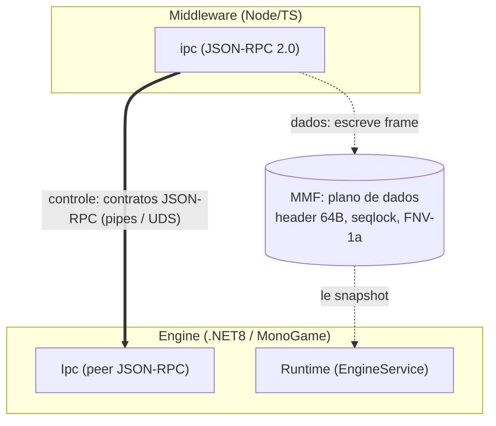
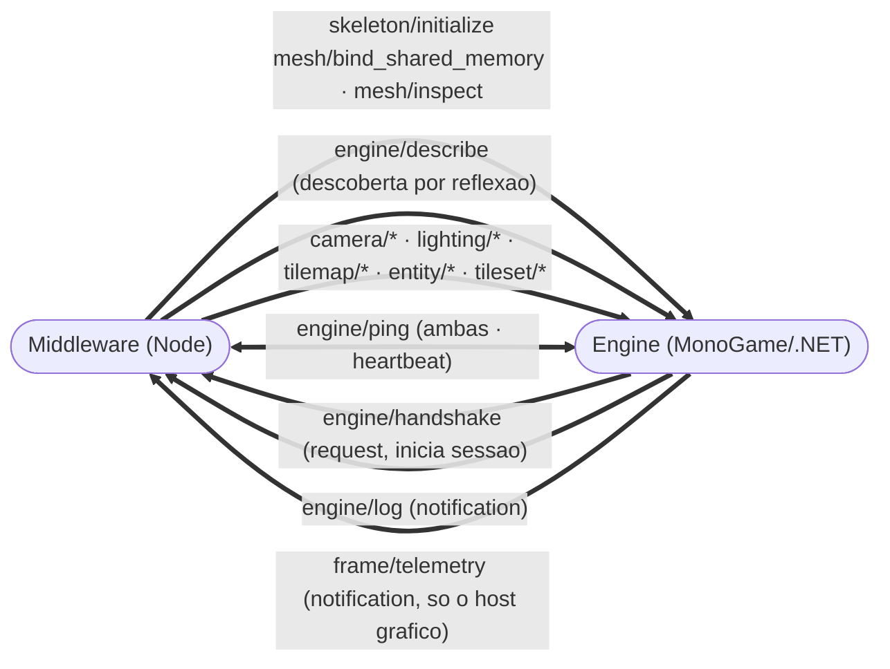
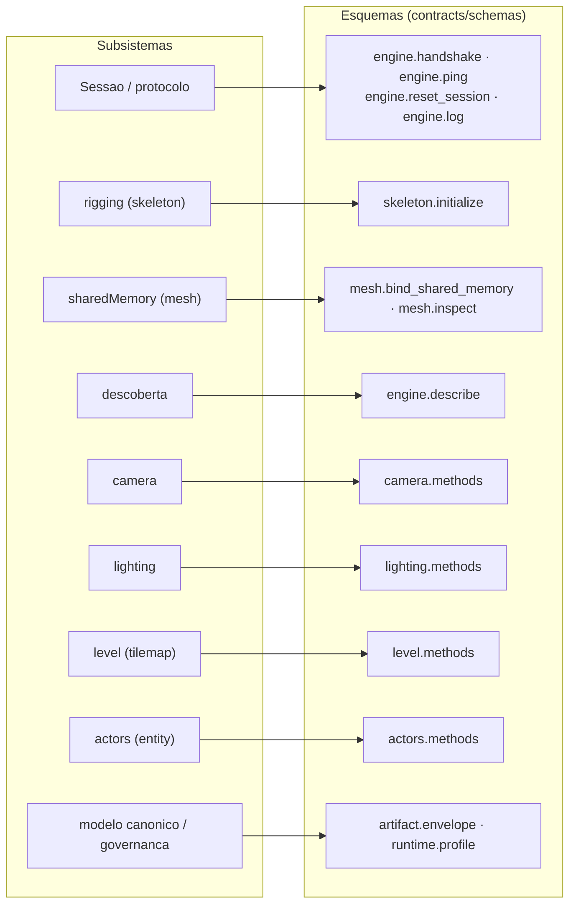
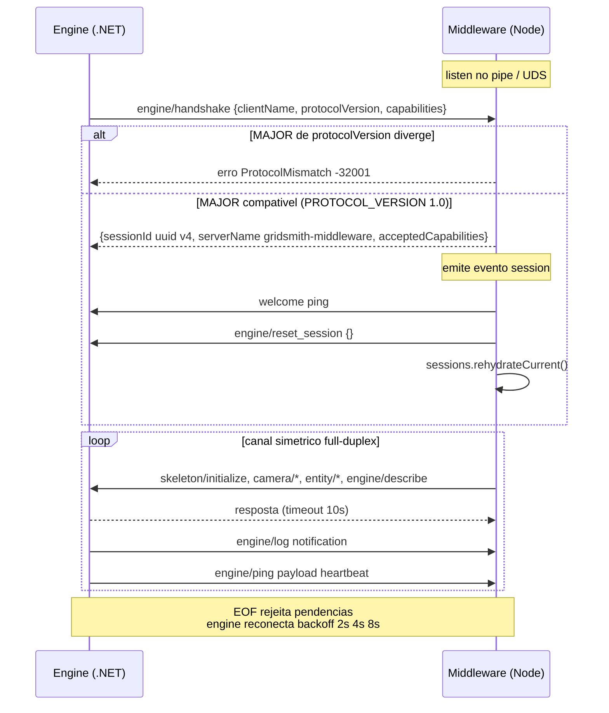

# Contratos de fio do ecossistema

Fonte única de verdade dos contratos trafegados entre os processos do Gridsmith, em
três famílias:

1. **Plano de controle middleware ↔ engine** — JSON-RPC 2.0 sobre Named Pipes /
   Unix Domain Sockets ([`schemas/`](schemas/), este documento).
2. **Plano de dados middleware ↔ engine** — vértices via memory-mapped file com
   seqlock ([`shared-memory-layout.md`](shared-memory-layout.md)).
3. **Transports do app (Electron) ↔ middleware** — GraphQL baseline/fallback
   ([`graphql/`](graphql/)) + gRPC no caminho quente ([`grpc/`](grpc/)); ver a
   seção [Contratos do app](#contratos-do-app-electron--middleware).

*Mostra onde os contratos deste documento se encaixam: o plano de controle JSON-RPC entre middleware e engine, distinto do plano de dados MMF/seqlock.*

## Métodos

| Método | Direção | Tipo | Esquema |
|---|---|---|---|
| `engine/handshake` | engine → middleware | request | [`schemas/engine.handshake.schema.json`](schemas/engine.handshake.schema.json) |
| `engine/ping` | ambas | request | [`schemas/engine.ping.schema.json`](schemas/engine.ping.schema.json) |
| `engine/reset_session` | middleware → engine | request | [`schemas/engine.reset_session.schema.json`](schemas/engine.reset_session.schema.json) |
| `engine/log` | engine → middleware | notification | [`schemas/engine.log.schema.json`](schemas/engine.log.schema.json) |
| `frame/telemetry` | engine (host gráfico) → middleware | notification | [`schemas/frame.telemetry.schema.json`](schemas/frame.telemetry.schema.json) |
| `skeleton/initialize` | middleware → engine | request | [`schemas/skeleton.initialize.schema.json`](schemas/skeleton.initialize.schema.json) |
| `mesh/bind_shared_memory` | middleware → engine | request | [`schemas/mesh.bind_shared_memory.schema.json`](schemas/mesh.bind_shared_memory.schema.json) |
| `engine/describe` | middleware → engine | request | [`schemas/engine.describe.schema.json`](schemas/engine.describe.schema.json) |
| `mesh/inspect` | middleware → engine | request | [`schemas/mesh.inspect.schema.json`](schemas/mesh.inspect.schema.json) |
| `camera/configure`, `camera/shake`, `camera/simulate` | middleware → engine | request | [`schemas/camera.methods.schema.json`](schemas/camera.methods.schema.json) |
| `lighting/add`, `lighting/remove`, `lighting/inspect`, `lighting/evaluate` | middleware → engine | request | [`schemas/lighting.methods.schema.json`](schemas/lighting.methods.schema.json) |
| `tilemap/define`, `tilemap/remove`, `tilemap/inspect` | middleware → engine | request | [`schemas/level.methods.schema.json`](schemas/level.methods.schema.json) |
| `entity/spawn`, `entity/move`, `entity/despawn`, `entity/inspect` | middleware → engine | request | [`schemas/actors.methods.schema.json`](schemas/actors.methods.schema.json) |
| `tileset/apply`, `tileset/clear` | middleware → engine | request | [`schemas/tileset.methods.schema.json`](schemas/tileset.methods.schema.json) |

O canal é simétrico full-duplex, mas cada método tem uma direção canônica. O
middleware comanda a cena (skeleton/mesh/camera/lighting/tilemap/entity/tileset) e
descobre capacidades (`engine/describe`); a engine inicia a sessão
(`engine/handshake`), notifica logs (`engine/log`) e — quando é o host gráfico —
telemetria do que desenhou (`frame/telemetry`); `engine/ping` flui nos dois
sentidos (também como heartbeat).

As duas notificações da engine são o **fio de volta**: tudo o mais neste
contrato é o middleware mandando e a engine respondendo.

*Mostra o fluxo de mensagens por direção: o que o middleware envia à engine, o que a engine envia ao middleware e o método bidirecional (engine/ping).*

## Modelo canônico e governança

| Contrato | Esquema |
|---|---|
| Payload dos comandos canônicos (o que as bordas recebem) | [`schemas/blueprint.commands.schema.json`](schemas/blueprint.commands.schema.json) |
| Envelope de artefato versionável | [`schemas/artifact.envelope.schema.json`](schemas/artifact.envelope.schema.json) |
| Perfil versionado de runtime | [`schemas/runtime.profile.schema.json`](schemas/runtime.profile.schema.json) |

O schema de comandos é uma das **três fontes declarativas** do conjunto de
kinds, junto de `COMMAND_KINDS` (middleware) e do enum `CommandKind` do SDL.
O lint de contratos do `npm run docs:verify` exige que as três cubram
exatamente o mesmo conjunto — acrescentar um comando pela metade quebra o CI.

O desenho completo (comandos, eventos, hooks, filters, pipelines, adapters e
governança da experiência) está em [`../docs/CANONICAL-MODEL.md`](../docs/CANONICAL-MODEL.md).

O mapa abaixo liga cada subsistema ao(s) arquivo(s) de esquema em `contracts/schemas`
que definem seus contratos — a mesma partição das tabelas acima, vista por subsistema.

*Mostra o mapa contratos->schemas por subsistema: cada subsistema aponta para os arquivos .schema.json que definem seus métodos e artefatos.*

## Contratos do app (Electron ↔ middleware)

A borda app ↔ middleware **não** usa o plano JSON-RPC acima: usa GraphQL
(superfície baseline completa + destino do fallback) e gRPC (caminho quente
prioritário) — decisões em [`../docs/adr/`](../docs/adr/README.md)
(ADR-016/017/018/019/020).

| Contrato | Arquivo | Papel | Operações |
|---|---|---|---|
| GraphQL SDL | [`graphql/editor.schema.graphql`](graphql/editor.schema.graphql) | baseline completa + fallback | queries de projeto/projeção/snapshot/eventos · mutations `projectCreate`, `projectOpenDocument`, `projectClose`, `dispatch` + aliases legados |
| gRPC proto | [`grpc/gridsmith_editor.proto`](grpc/gridsmith_editor.proto) — `gridsmith.editor.v1.EditorHotPath` | caminho quente condicionado pela ADR-019 | `ProjectCreate`, `ProjectOpenDocument`, `ProjectClose`, `ProjectStatus`, dispatch/query/snapshot + `StreamEventsV2` |

Regras de evolução:

- Edite **sempre** os arquivos daqui — nunca as cópias em
  `middleware/dist/contracts/` (o build as regenera e um teste de paridade
  exige byte-igualdade).
- O enum `CommandKind` do SDL espelha `COMMAND_KINDS` do modelo canônico, com
  `_` no lugar da primeira `/` (GraphQL não aceita `/` em valores de enum).
- Os payloads de comando viajam como JSON (`payload` no GraphQL,
  `payload_json` no proto) e são validados na **mesma fonte única**
  (`BlueprintStore` + [`schemas/`](schemas/)) — os transports não introduzem
  segunda fonte de validação.
- Clientes novos usam cursor composto `(middlewareInstanceId, projectSessionId, seq)` e strings
  decimais para `uint64`. `resyncRequired` obriga snapshot completo; APIs
  legadas sem identidade de sessão falham explicitamente em vez de misturar projetos.
- Create/open/close aceitam `expectedProjectSessionId` para compare-and-swap;
  candidato preparado sobre uma sessão antiga falha com
  `PROJECT_SESSION_CONFLICT` em vez de sobrescrever o projeto mais novo.
- `ProjectStatus.runtimeState` é `synchronized`, `deferred` ou `failed`.
  `failed` bloqueia mutações até uma reidratação integral restaurar o runtime.
- GraphQL exige `Authorization: Bearer`; gRPC exige a mesma credencial em
  metadata. Autenticação não participa da política de fallback.
- Compatibilidade e breaking changes destes eixos:
  [`../docs/COMPATIBILITY.md`](../docs/COMPATIBILITY.md).

## Plano de dados

O layout binário do memory-mapped file (header, seqlock, vertex layout, checksum)
está especificado em [`shared-memory-layout.md`](shared-memory-layout.md). Os offsets
de vértice publicados em `engine/describe` são derivados por reflexão das structs C# —
o escritor Node.js deve sempre usar o layout publicado, nunca offsets hardcoded.

## Versionamento

A versão do protocolo é `MAJOR.MINOR` e é negociada no `engine/handshake`:

- **MAJOR** diferente → conexão recusada (erro `-32001 PROTOCOL_MISMATCH`).
- **MINOR** diferente → aceita; campos desconhecidos são ignorados pelos dois lados.

Versão atual: **1.0** (constante `PROTOCOL_VERSION` em ambas as implementações).

A negociação acontece no ciclo de vida da conexão: a engine conecta e faz o
handshake, o middleware valida **só o MAJOR**, responde com `sessionId` (uuid v4) e
emite a sessão. A cada sessão nova o middleware faz welcome ping e pede ao
`ProjectSessionManager` que resete a engine e reidrate somente o projeto ativo.

*Mostra o handshake que negocia a versão (só o MAJOR), a criação de sessão com rehidratação e o canal full-duplex com reconexão por backoff.*

## Códigos de erro de domínio

Ver [`schemas/error-codes.md`](schemas/error-codes.md).
