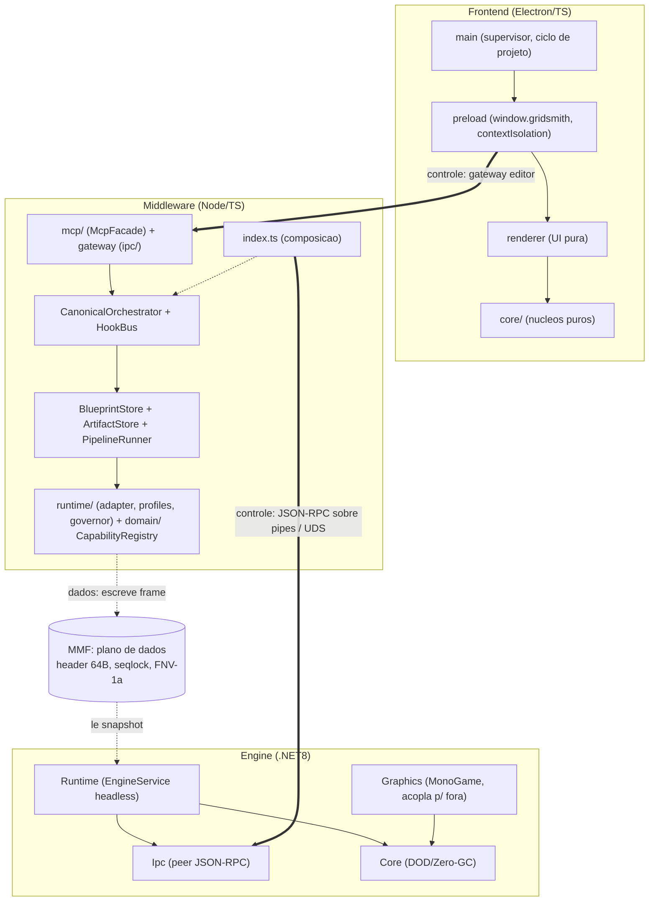
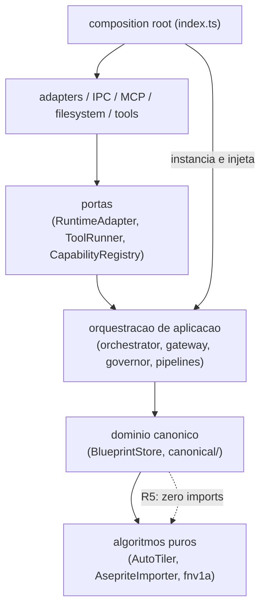
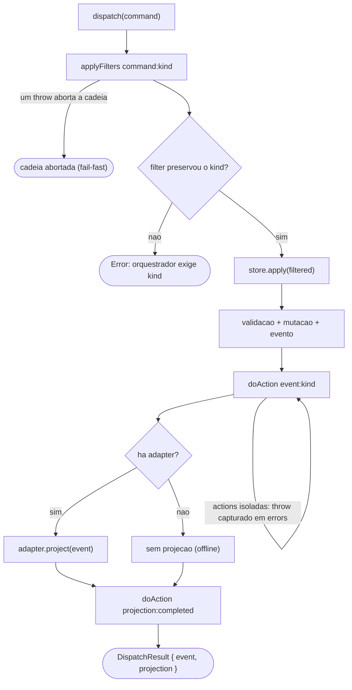
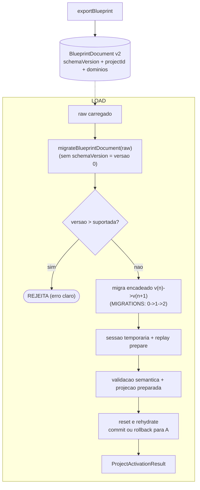
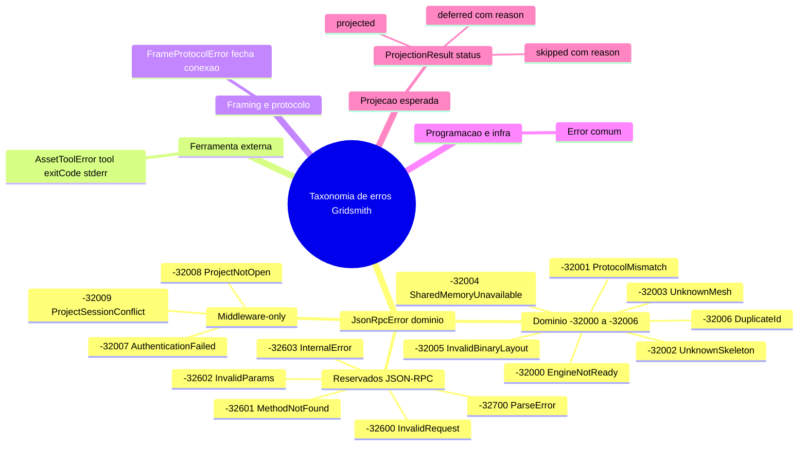
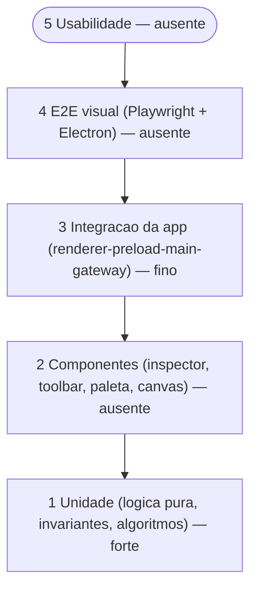
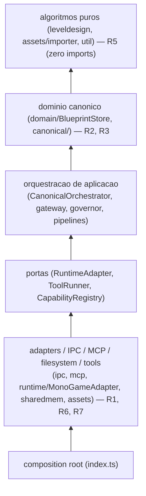
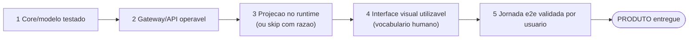

# Gridsmith Design — Especificação Técnica Normativa (Constituição de Engenharia)

> **Natureza deste documento.** Especificação **normativa** construída a partir do
> código, contratos, testes e documentação **efetivamente existentes** no
> repositório. Não descreve uma arquitetura
> idealizada: cada regra referencia evidência real. Onde a evidência é
> insuficiente, o texto declara explicitamente
> «Não foi possível confirmar esta afirmação no estado analisado do repositório.»
> Complementa (não substitui) `ARCHITECTURE.md`, `CANONICAL-MODEL.md` e
> `GOVERNANCE.md`; em caso de conflito sobre uma regra executável, **o teste que
> a impõe tem precedência sobre qualquer texto**.

**Proveniência da análise.** Esta revisão descreve o estado do código no commit
de referência abaixo. Contagens voláteis (ex.: número de testes) **não** são
fixadas neste documento — são calculadas e validadas pelo CI (ver
[`GOVERNANCE.md`](GOVERNANCE.md) §4, fontes de verdade).

| Campo | Valor |
|---|---|
| Repository | `flaviotinococoutinho/p7m-design` |
| Branch analisada | `main` |
| Commit de referência | `d8220d5` |
| Data da revisão | 2026-07-16 |

## Legendas

**Palavras-chave normativas (RFC 2119 / RFC 8174, aplicadas em pt-BR):**

| Termo | Significado | Equivalente RFC |
|---|---|---|
| **DEVE** / **NÃO DEVE** | Requisito absoluto / proibição absoluta | MUST / MUST NOT |
| **DEVERIA** / **NÃO DEVERIA** | Recomendação forte; desvios exigem justificativa registrada | SHOULD / SHOULD NOT |
| **PODE** | Opcional, à discrição da implementação | MAY |

As palavras-chave só têm força normativa quando **em maiúsculas**.

**Classificação de evidência (aplicada a conclusões e recomendações):**

| Tag | Significado |
|---|---|
| **CONFIRMADO** | Verificado diretamente no código/teste/contrato citado |
| **RISCO** | Fragilidade real observada, com modo de falha concreto |
| **HIPÓTESE** | Inferência plausível ainda não verificada em execução |
| **DIVERGÊNCIA** | Código e documentação (ou dois artefatos) discordam |
| **DECISÃO NECESSÁRIA** | Escolha de arquitetura em aberto que exige o dono do produto |
| **MELHORIA OPCIONAL** | Ganho possível sem urgência; não bloqueia evolução |
| **NÃO APLICÁVEL** | Item do escopo sem correspondência no projeto atual |

---

## 1. Resumo executivo

O Gridsmith é um **ecossistema Engine-as-a-Service local** de três processos
desacoplados — editor Electron/TypeScript, middleware Node.js/TypeScript e engine
.NET 8/MonoGame — mediados por um **modelo canônico** independente de runtime e por
**contratos versionados** (JSON Schema, layouts binários, perfis de runtime). A
arquitetura já é **madura na plataforma** e **executável em suas regras**: 25 regras
arquiteturais são testes que quebram o CI (`GOVERNANCE.md`), a compatibilidade
binária entre TS e C# é provada por checksums cruzados em e2e, e o hot path da engine
é verificado como Zero-GC por asserções de alocação. **CONFIRMADO.**

A tese central desta especificação: **preservar as fronteiras que já existem e que
já são impostas por teste, formalizar as poucas que hoje só existem por convenção, e
não introduzir nenhum paradigma único.** O sistema é deliberadamente **híbrido** —
orientado a objetos no domínio e nas bordas, Data-Oriented nos hot loops, funcional
nas transformações puras — e a maior parte do valor futuro está em **converter a
plataforma em produto** (a camada visual e sua cobertura de testes), não em
reescrever a base.

Três achados estruturais orientam as recomendações:

1. O **contrato de adapter de runtime fecha o ciclo de sessão** — `RuntimeAdapter`
   exige `project`, `resetSession` e `rehydrateFrom`. Assim, todo adapter deve limpar o
   projeto anterior antes de reidratar o seguinte. **CONFIRMADO** pela ADR-020.
2. A **explicabilidade** é imposta pelo tipo: `ProjectionResult` é uma união
   discriminada; `reason` é obrigatório nos ramos `skipped` e `deferred` e proibido
   no ramo `projected`. **CONFIRMADO.**
3. A **cobertura de testes espelha o diagnóstico de produto**: núcleos puros
   fortemente testados (suíte completa validada pelo CI), mas a camada de produto — `renderer.ts` (738
   linhas) e o wire de `main.ts` (440 linhas) — sem teste automatizado, e sem e2e
   visual da jornada de aceite. **RISCO.**

Nenhuma reescrita é recomendada. Toda evolução relevante cabe em passos incrementais
sobre as fronteiras atuais.

---

## 2. Estado arquitetural observado

**Topologia (CONFIRMADO — `README.md`, `docs/ARCHITECTURE.md`, `index.ts`):** três
processos locais.

- **Frontend** (`frontend/`, Electron + TS): `main/` (processo Node privilegiado),
  `preload/` (ponte `window.gridsmith` com contextIsolation), `renderer/` (UI pura sobre
  `core/`), `core/` (12 módulos puros e testáveis fora do Electron).
- **Middleware** (`middleware/`, Node + TS): módulos `protocol/`, `ipc/`, `domain/`,
  `canonical/`, `runtime/` (+`runtime/profiles/`), `mcp/`, `assets/`, `leveldesign/`,
  `sharedmem/`, `util/`, `tools/`, e a raiz de composição `index.ts`.
- **Engine** (`engine/`, .NET 8): quatro assemblies — `Gridsmith.Engine.Core` (DOD/Zero-GC),
  `Gridsmith.Engine.Ipc` (plano de controle), `Gridsmith.Engine.Graphics` (MonoGame),
  `Gridsmith.Engine.Runtime` (serviço headless que orquestra Core+Ipc).
- **Contratos** (`contracts/`): JSON Schema dos métodos JSON-RPC, `error-codes.md`,
  `shared-memory-layout.md`, envelope de artefato, perfil de runtime.

**Dois planos coexistentes (CONFIRMADO — `ARCHITECTURE.md`, `shared-memory-layout.md`):**

- **Plano de controle**: JSON-RPC 2.0 full-duplex simétrico, framing
  `[uint32 LE body-length][UTF-8 body]`, sobre Named Pipes (Windows) / Unix Domain
  Sockets (POSIX).
- **Plano de dados**: Memory-Mapped Files com header de 64 bytes, seqlock e checksum
  FNV-1a, layout `LayoutKind.Sequential` publicado por reflexão.

**Núcleo semântico (CONFIRMADO — `CANONICAL-MODEL.md`):** o modelo canônico
(`BlueprintStore` + `CanonicalOrchestrator` + `HookBus`) é a fonte de verdade;
runtimes recebem **projeções** via adapters; a experiência visual é **governada** por
perfis versionados cruzados com o manifesto vivo.

**Maturidade honesta (CONFIRMADO — `REQUIREMENTS.md` §1):** colunas Core/Gateway/
Projeção majoritariamente verdes; colunas UI-visual/Jornada-e2e majoritariamente
vermelhas. A milestone `ALPHA-0.1.md` congela expansão horizontal para fechar o corte
vertical `Projeto → Asset → Entidade → Nível → Preview → Live edit → Save/reopen`.

---

## 3. Pontos fortes (a preservar)

1. **Governança executável, não documental** — 25 regras (R1–R13, F1–F6, E1–E6) são
   testes que quebram o CI com o arquivo infrator no erro
   (`middleware/test/architecture.test.ts`, `frontend/test/architecture.test.ts`,
   `engine/tests/.../ArchitectureTests.cs`). **CONFIRMADO.**
2. **Caminho de mutação único e determinístico** — todo write passa por
   `dispatch → applyFilters(command:<kind>) → store.apply → doAction(event:<kind>) →
   adapter.project → doAction(projection:completed)`
   (`CanonicalOrchestrator.ts:31-51`). **CONFIRMADO.**
3. **Compatibilidade binária provada, não assumida** — offsets por
   `Marshal.OffsetOf` publicados em `engine/describe`, e checksum FNV-1a cruzado nos
   e2e (`shared-memory-layout.md`; `scripts/verify-phase2.sh`). **CONFIRMADO.**
4. **Zero-GC verificado** — testes `*_is_allocation_free` (um por hot loop) medem
   `GC.GetAllocatedBytesForCurrentThread()` e exigem delta 0 após warmup de JIT
   escalonado. **CONFIRMADO** (ver §33).
5. **Determinismo por seed** — AutoTiler, screen shake e simulação de câmera testados
   por igualdade bit a bit com o mesmo seed. **CONFIRMADO** (`GOVERNANCE.md:48`).
6. **Explicabilidade de primeira classe** — `skipped`/`deferred` carregam razão
   acionável; a matriz do `ExperienceGovernor` justifica cada recurso habilitado/
   desabilitado. **CONFIRMADO** (`ExperienceGovernor.ts:70-119`).
7. **Taxonomia de protocolo explícita** — `PROTOCOL_VERSION="1.0"`, framing e 12 dos
   15 códigos TS são compartilhados com C#; os três restantes protegem somente a borda
   local do middleware (`AuthenticationFailed`, `ProjectNotOpen` e
   `ProjectSessionConflict`). **CONFIRMADO.**
8. **Composition root explícita** — todas as dependências são instanciadas uma vez em
   `index.ts main()` e injetadas por construtor; nenhum service-locator.
   **CONFIRMADO** (`index.ts:46-163`).
9. **Fachadas realmente finas** — R1 impede SDK MCP/`zod` fora de `mcp/`; a fachada
   despacha pelo mesmo orquestrador da UI. **CONFIRMADO.**
10. **Núcleos algorítmicos portáveis** — R5 exige zero imports em `AutoTiler`,
    `AsepriteImporter`, `fnv1a`, garantindo vendorização segura para workers.
    **CONFIRMADO.**

Estes dez itens são **invioláveis** (ver §5) e **NÃO DEVEM** ser refatorados por
preferência estética (ver Apêndice H).

---

## 4. Inconsistências entre código e documentação

| # | Inconsistência | Evidência | Classificação | Ação |
|---|---|---|---|---|
| I-1 | `RuntimeAdapter` não declarava limpeza/reidratação de sessão | `RuntimeAdapter.ts` agora exige `resetSession` e `rehydrateFrom`; `MonoGameAdapter` implementa ambos | **CONFIRMADO** (resolvida pela ADR-020) | Manter testes de contrato e rollback de runtime |
| I-2 | `GOVERNANCE.md` fixava contagens de teste no próprio texto (propensas a drift) | `GOVERNANCE.md` | **DIVERGÊNCIA** (drift) | ✅ corrigido: contagens não são mais fixadas no texto — derivadas e validadas pelo CI (ver `GOVERNANCE.md` §4) |
| I-3 | `REQUIREMENTS.md` falava em "6 hot loops cobertos"; há **8** métodos `*_is_allocation_free` em 7 arquivos (`SkeletonStoreTests`, `MeshSharedMemoryReaderTests`, `SkinningPipelineTests`, `CameraDynamicsTests` ×2, `ActorTests`, `LightingTests`, `TilemapTests`) | `REQUIREMENTS.md:44` | **DIVERGÊNCIA** (subcontagem) | ✅ corrigido nesta revisão |
| I-4 | `ARCHITECTURE.md` listava `engine/heartbeat` como notification; o heartbeat real é um `engine/ping` com payload `"heartbeat"` | `ARCHITECTURE.md:76`; `engine/src/Gridsmith.Engine.Runtime/Program.cs:68` | **DIVERGÊNCIA** | ✅ corrigido nesta revisão |
| I-5 | `ARCHITECTURE.md` §capacidades dizia "Quando a Fase 3 adicionar câmera e iluminação…" (tempo futuro) — Fase 3 concluída | `ARCHITECTURE.md:44-45` | **DIVERGÊNCIA** (drift) | ✅ corrigido nesta revisão |
| I-6 | Tabela de códigos de erro nomeia em SCREAMING_SNAKE (`ENGINE_NOT_READY`); o código usa PascalCase (`EngineNotReady`) | `contracts/schemas/error-codes.md` vs `jsonrpc.ts:42-56` e `JsonRpcProtocol.cs:16-31` | **DIVERGÊNCIA** (cosmética; valores idênticos) | Nota de mapeamento no contrato |

Nenhuma divergência remanescente afeta comportamento em runtime; I-1 foi fechada por
tipo e por teste na sessão transacional da ADR-020.

---

## 5. Princípios invioláveis (constituição)

Estes princípios são **normativos e permanentes**. Cada um já é imposto por teste ou
o será (ver §33). Alterá-los exige um ADR de revogação (§32).

- **P-1 — Mutação única.** Nenhuma borda externa (Electron, MCP, JSON-RPC, scripts,
  ferramentas de IA, importadores, watchers, pipelines, adapters, engine) **DEVE**
  alterar o estado canônico diretamente. Toda mutação **DEVE** passar por
  `CanonicalOrchestrator.dispatch`. *Imposto por R2, R7 e testes de gateway/adapter.*
- **P-2 — Runtime não contamina o canônico.** O modelo canônico (`canonical/`,
  `domain/BlueprintStore`) **NÃO DEVE** importar transporte, MCP, adapter concreto ou
  plano de dados. *Imposto por R2, R3.*
- **P-3 — Adapter é o único tradutor.** Somente o adapter **DEVE** traduzir eventos
  canônicos em operações de runtime. *Imposto por R7.*
- **P-4 — Contratos são fonte de verdade.** Todo método JSON-RPC, artefato, perfil e
  layout binário **DEVE** ter contrato em `contracts/`, refletido nos dois lados do
  fio. *Imposto por R8, R9 + DoD.*
- **P-5 — Hot loop é Zero-GC.** `Update`/`Draw`-path e leituras de shared memory
  **NÃO DEVEM** alocar. *Imposto pelos testes `*_is_allocation_free`.*
- **P-6 — Determinismo por seed.** Algoritmos com seed (AutoTiler, shake, simulação)
  **DEVEM** produzir saída bit a bit idêntica para a mesma entrada. *Imposto por
  testes de igualdade.*
- **P-7 — Explicabilidade.** Nenhum recurso **DEVE** ser desabilitado, pulado ou
  adiado sem razão legível (`reason`). *Imposto por testes do governor/gate; ver
  a união discriminada `ProjectionResult`, que torna `reason` obrigatório em
  `skipped`/`deferred`.*
- **P-8 — Núcleo portável.** `core/` do frontend e os núcleos algorítmicos do
  middleware **DEVEM** permanecer puros (sem Electron/Node/transporte). *Imposto por
  F1, R5.*
- **P-9 — Perfis imutáveis.** Um perfil de runtime publicado **NÃO DEVE** ser
  alterado; mudanças entram como nova versão. *Imposto por
  `RuntimeProfileRegistry.register` (`RuntimeProfile.ts:60-64`).*
- **P-10 — Persistência por replay.** Carregar projeto **DEVE** reproduzir o documento
  como comandos pelo orquestrador; o load **NÃO DEVE** injetar estado ignorando
  filters/validação/histórico. O replay **DEVE** ocorrer numa sessão temporária,
  sem actions/journal/runtime, antes do commit. *Imposto por
  `ProjectSessionManager` + `BlueprintSerializer.replayDocument`.*

---

## 6. Mapa de camadas

*Mostra as tres camadas locais (frontend, middleware, engine) e os dois planos ortogonais: controle (JSON-RPC sobre pipes/UDS, aresta grossa) e dados (MMF com seqlock, aresta pontilhada). A engine respeita E3/E4: Graphics referencia so Core, Runtime referencia Core+Ipc, nunca Graphics.*

**Planos (ortogonais às camadas):** *controle* (JSON-RPC) e *dados* (MMF) entre
middleware e engine; *modelo canônico* (verdade), *projeções de runtime* (adapters),
*experiência visual* (governor/gate) e *transporte* (protocol/ipc).

---

## 7. Regras de dependência (dependency rules)

A regra geral é a **Clean/Hexagonal**: dependências apontam **para dentro**; o
interno (algoritmos puros → domínio canônico → orquestração → portas) nunca conhece o
externo (adapters/IPC/MCP/filesystem/tools/composição). **CONFIRMADO** por R1–R13.

*Mostra a regra de dependência do middleware: toda seta aponta para dentro (composition root -> externo -> portas -> orquestração -> domínio -> algoritmos puros); o interno nunca conhece o externo. Nenhuma reescrita relaxa a regra — a correção é mover a dependência (R1-R13).*

**Middleware — grafo permitido (imposto por import-graph scanning,
`architecture.test.ts:25-66`):**

| Camada | PODE importar | NÃO DEVE importar | Regra |
|---|---|---|---|
| `leveldesign/AutoTiler`, `assets/AsepriteImporter`, `util/fnv1a` | **nada** | qualquer coisa | R5 |
| `domain/BlueprintStore` | `leveldesign/AutoTiler`, `protocol/jsonrpc` | todo o resto | R3 |
| `canonical/` | domínio, protocolo, algoritmos puros | `ipc/`, `mcp/`, `sharedmem/`, `assets/`, `tools/`, `runtime/MonoGameAdapter`, `index` | R2 |
| `runtime/profiles/` | `runtime/RuntimeProfile` | tudo mais (relativo) | R4 |
| `mcp/` | SDK MCP, `zod`, orquestrador (fachada) | — (mas é o **único** que importa o SDK/`zod`) | R1 |
| `runtime/MonoGameAdapter` (concreto) | — | referenciável só por `index`, `tools/`, `runtime/`, `mcp/` | R7 |
| `node:net` | só `ipc/`, `tools/`, `index` | qualquer outra camada | R6 |

**Engine — grafo permitido (imposto por reflexão de assembly,
`ArchitectureTests.cs`):**

| Assembly | Referencia (Gridsmith.*) | Regra |
|---|---|---|
| `Core` | **nenhum** Gridsmith; **nenhum** MonoGame | E1, E5 |
| `Ipc` | **nenhum** Gridsmith | E2 |
| `Graphics` | exatamente `{Core}` | E3 |
| `Runtime` | exatamente `{Core, Ipc}` (não Graphics) | E4 |

**Frontend (imposto por scanning de import/source):**

| Camada | Regra |
|---|---|
| `core/` só importa relativo (sem Electron/Node/`@gridsmith/*`) | F1 |
| `renderer/` sem Electron/Node; `main/` só como *type* | F2 |
| `electron` só em `main/` | F3 |
| nenhuma reimplementação de framing (`writeUInt32LE`/`readUInt32LE` proibido no source) | F4 |

**Regra normativa de evolução:** ao adicionar um módulo, o autor **DEVE** posicioná-lo
de modo que nenhuma seta aponte de dentro para fora; se um teste R/F/E quebrar, a
correção **DEVE** ser mover a dependência, não relaxar a regra.

---

## 8. Modelo canônico

**Fluxo normativo (CONFIRMADO — `CanonicalOrchestrator.ts:31-51`):**

*Mostra a cadeia unica de mutacao dispatch->filters->store.apply->actions->projecao e as duas politicas de erro do HookBus: filters FALHAM RAPIDO (um throw aborta a cadeia) enquanto actions sao ISOLADAS (throw capturado, nao derruba os demais). A projecao e condicional ao adapter injetado.*

**Responsabilidades (normativas):**

- **`BlueprintCommand`** — *intenção* imutável, discriminada por `kind` com namespace
  `dominio/verbo` (14 kinds, `BlueprintStore.ts:121-135`). **DEVE** conter só dados;
  **NÃO DEVE** carregar objetos de framework. Reconstruído do par (kind, payload) por
  `reshapeCommand` nas bordas (`commandShape.ts:26-60`), que **NÃO** valida conteúdo.
- **`BlueprintEvent`** — *fato* imutável, discriminado por `kind` camelCase no passado
  (14 kinds, `:154-169`). `entityPlaced`/`entityMoved` são **enriquecidos** com a
  entidade resolvida e `archetypeId?` para a projeção não consultar o store (`:161-163`).
- **`BlueprintStore`** — coração do domínio (R3): guarda 7 `Map` + `camera` escalar
  (`:175-182`); `apply(command)` valida (via `JsonRpcError` com códigos tipados),
  aplica invariantes referenciais (mesh→skeleton, entity→entityDef, world→level;
  `:227,318,367`), congela o valor guardado, emite `"event"`. `isEmpty` cobre **todos**
  os stores (`:441-452`).
- **`CanonicalOrchestrator`** — mediador do fluxo (`:31`); **DEVE** manter o kind do
  comando após filters (lança `Error` se um filter o corromper, `:36-41`); a projeção é
  **opcional** (adapter injetado como `adapter?`), permitindo operação offline.
- **`ProjectSessionManager`** — porta substituível da sessão publicada; cria store,
  orquestrador e histórico privados, prepara replay sem actions/journal/runtime e troca
  a referência ativa somente após reset + reidratação do candidato. Create/open/close
  **DEVEM** validar `expectedProjectSessionId` como compare-and-swap quando fornecido.
- **`HookBus`** — extensão governada (`HookBus.ts`): **Filters** transformam em cadeia
  e **falham rápido** (um throw aborta a cadeia); **Actions** notificam e são
  **isoladas** (um throw é capturado, coletado em `errors`, não derruba os demais).
  Ordem determinística: `priority` ascendente (default 10), desempate por ordem de
  registro (`:119-122`). Inspecionável via `listHooks()`.
- **`ArtifactStore`** — histórico append-only por `artifactId` (`ArtifactStore.ts`);
  `contentHash` = FNV-1a hex (8 chars) sobre *stable stringify* (chaves ordenadas
  recursivamente); **dedup** exige `(contentHash, schemaVersion)` iguais; `revision`
  monotônico a partir de 1; **proveniência `metadata.createdBy` obrigatória** (`:142`).
- **`PipelineRunner`** — estágios como cadeias de filters
  (`pipeline:<id>:<stage>`); `run()` retorna o `ArtifactEnvelope` publicado
  (`Pipeline.ts:59-92`). **Sem cancelamento/retry/timeout** hoje (ver RISCO §11, §22).
- **Adapters** — projetam eventos; ver §12.
- **Reidratação** — `RuntimeAdapter.resetSession/rehydrateFrom`, implementados pelo
  `MonoGameAdapter`, na
  ordem esqueletos→malhas→câmera→luzes→níveis→entidades; **único dono da projeção,
  inclusive na reconexão**.

**Regra normativa:** um novo comando **DEVE** (DoD): validar no `BlueprintStore` +
entrar em `COMMAND_KINDS` (R8 pega o esquecimento) + ter projeção no(s) adapter(s) ou
`skipped` com razão + reidratação + serialização (`BlueprintSerializer`) + broadcast.

---

## 9. Casos de uso e serviços de aplicação

Casos de uso reais, extraídos do gateway, do ciclo de vida e do pipeline de assets.
Cada um orquestra o domínio; nenhum o substitui.

| Caso de uso | Entrada | Efeito / Evento | Offline (engine caída) | Sem capacidade | Evidência |
|---|---|---|---|---|---|
| **Criar projeto (vazio/template)** | `projectId?`, `templateId?`, `expectedProjectSessionId?` | `ProjectSessionManager` prepara e substitui a sessão por CAS; `project/create` em todas as bordas | sessão ativa com runtime `deferred` | idem | `ProjectSessionManager.ts`; `EditorSurface.ts` |
| **Abrir projeto** | documento `.gridsmith.json`, `expectedProjectSessionId?` | parse → migração → validação → sessão temporária → replay → semântica → reset/rehydrate → commit por CAS | commit com runtime `deferred`; reconexão usa apenas a sessão ativa | idem | `project/openDocument`; `ProjectSessionManager.ts`; ADR-020 |
| **Fechar projeto** | `expectedProjectSessionId?` | reset de runtime e remoção atômica da referência ativa | fecha a sessão; engine nova nasce limpa | N/A | `project/close`; `engine/reset_session` |
| **Consultar projeto** | — | `project/status` retorna ids, sequência e `runtimeState: synchronized\|deferred\|failed` | explicita degradação sem alterar sessão | N/A | `EditorSurface.projectStatus`; quatro bordas |
| **Salvar projeto** | — | `exportBlueprint` → snapshot declarativo | funciona (verdade é o store) | N/A | `EditorClient.saveDocument` |
| **Definir/editar nível** | IntGrid + regras | `levelDefined`/`levelUpdated` → auto-tiling resolvido no adapter → `tilemap/define` | `deferred` | painel `level-editor` gated | `MonoGameAdapter.ts:100-114` |
| **Posicionar entidade** | entityId, def, posição | `entityPlaced` → `entity/spawn` se houver `archetypeId` | `deferred` | `skipped` com razão | `MonoGameAdapter.ts:127-145` |
| **Mover entidade (live)** | entityId, posição | `entityMoved` → `entity/move` (upsert se não spawnada) | `deferred` | `skipped` | `:147-170` |
| **Configurar câmera** | settings | `cameraConfigured` → `camera/configure` | `deferred` | — | `:72-75` |
| **Adicionar luz** | LightSpec | `lightAdded` → `lighting/add` (remapeia id) | `deferred` | — | `:77-84` |
| **Importar asset** | caminho `.aseprite` | pipeline `parse→enrich` → artefato `sprite-document` + `.xnb` | independe da engine | `AssetToolError` tipado | `AssetPipelineService.ingest:119-185` |
| **Publicar artefato** | payload + proveniência | revisão append-only (dedup por hash) | independe | N/A | `ArtifactStore.publish:82-112` |
| **Executar pipeline** | pipelineId, input | `ArtifactEnvelope` | independe | N/A | `PipelineRunner.run:59-92` |
| **Resolver capacidade/experiência** | family, version | matriz de decisões com razões | fail-safe: `requiresSubsystem` → desabilitado | razão explícita | `ExperienceGovernor.resolve:52-68` |
| **Conectar/reidratar runtime** | sessão nova | `rehydrateFrom(store)` projeta tudo | N/A | N/A | `MonoGameAdapter.ts:201`; `index.ts:120-138` |
| **Supervisionar processos** | — | spawn/health/retry/shutdown | modo degradado (engine `optional`) | N/A | `ProcessSupervisor.ts`; `main.ts` |

`ProjectStatus.runtimeState` é diagnóstico técnico: `synchronized` significa que o
runtime representa a sessão ativa; `deferred`, que não havia runtime conectado e a
reidratação ficou pendente; `failed`, que uma tentativa conectada de reset/reidratação
falhou. Esse último estado **NÃO** autoriza publicar uma sessão candidata: a sessão
anterior continua ativa (ou é restaurada) e o erro permanece explícito. O campo
`expectedProjectSessionId` é opcional no primeiro create, mas, quando enviado em
create/open/close, **DEVE** coincidir com a sessão ativa ou resultar em
`ProjectSessionConflict` sem efeitos.

**Regras normativas:** um caso de uso **NÃO DEVE** conter lógica de infraestrutura;
o frontend **NÃO DEVE** acessar a engine diretamente; ferramentas MCP **NÃO DEVEM**
acessar o store — despacham pelo orquestrador (P-1); UI e IA **NÃO DEVEM** duplicar o
fluxo (ambas usam `blueprint/dispatch`/`blueprint_command`). **CONFIRMADO.**

---

## 10. Orientação a objetos

OO é aplicada **onde há invariantes e comportamento**, não por contagem de classes.
**CONFIRMADO** — o domínio encapsula invariantes; as bordas usam objetos com contrato.

**Bem aplicado (preservar):**

- `BlueprintStore` encapsula invariantes referenciais e de unicidade; estado privado,
  mutação só por `apply`. **NÃO** é anêmico.
- `RuntimeProfileRegistry` encapsula a política de imutabilidade e resolução
  descendente. Comportamento real, não getter/setter.
- `HookBus`, `ArtifactStore`, `PipelineRunner`, `ExperienceGovernor` — serviços coesos
  com uma razão de mudar.
- `ProcessSupervisor` — máquina de estados de supervisão com launcher injetável.

**Value Objects — avaliação por evidência (hoje todos são `string`/`number` crus):**

| Conceito | Recomendação | Justificativa |
|---|---|---|
| `SchemaVersion`, `ProtocolVersion`, `layoutVersion` | **MELHORIA OPCIONAL** | Comparação e compatibilidade têm regra própria (`compareVersions`); um VO evitaria comparar versão com string arbitrária, mas hoje o risco é baixo |
| `ContentHash` | **MELHORIA OPCIONAL** | Já normalizado (FNV-1a hex 8) e centralizado em `ArtifactStore`; VO agregaria pouco |
| `RuntimeFamily`, `RuntimeVersion` | **MELHORIA OPCIONAL** | Pareados quase sempre juntos; um VO `RuntimeIdentity` **já existe** como interface (`RuntimeAdapter.ts:12-18`) |
| `EntityId`, `ProjectId`, `ArtifactId`, `CorrelationId`, `Seed`, `CapabilityId`, `PipelineId` | **NÃO recomendado agora** | Seriam wrappers de cerimônia sem invariante protegida; introduzi-los aumentaria ritual sem impedir erro de categoria real observado |

**Regra normativa:** **NÃO DEVE** criar VO que apenas espelhe uma `string` sem proteger
invariante ou impedir erro de categoria. **DEVERIA** criar VO quando um valor cru puder
ser trocado por outro do mesmo tipo primitivo com consequência silenciosa (candidato
mais forte: versões, se a superfície de comparação crescer).

**Evitar (não observado como problema hoje, mas normativo):** classes anêmicas que só
espelham JSON, service classes sem coesão, herança profunda, interface de implementação
única sem papel de porta arquitetural.

---

## 11. Data-Oriented Design

DOD é **exclusivo da engine `Core`** e dos caminhos de alta frequência. **CONFIRMADO** —
E1/E5 mantêm o `Core` livre de MonoGame e de outras camadas; os stores são SoA
pré-alocados.

**Estruturas observadas (CONFIRMADO):**

- **SoA com slots fixos + handles opacos:** `SkeletonStore`, `LightStore`,
  `TilemapStore` (`MaxCells = 256*256`), `ActorStore` (`ActorStore.cs`, slots de
  `entityId/archetypeId/x/y`, `Find`/`MoveTo` allocation-free). Toda memória alocada no
  construtor; slots reutilizados no remove (freelist implícita por id nulo).
- **Seqlock + buffer pré-alocado** no leitor de shared memory (`MeshSharedMemoryReader`):
  retry não aloca.
- **Consolidação em batch estático único** no tilemap (minimiza draw calls).

**Regras normativas para hot loops (`Update`/`Draw`/leitura de MMF):** **NÃO DEVE**
alocar, fazer boxing, usar LINQ, lambdas capturando contexto, strings, reflection,
virtual dispatch, exceções como controle de fluxo, coleções que redimensionam, nem
locks globais. **Imposto** pelos testes `*_is_allocation_free` (§33). Para cada
subsistema crítico, o autor **DEVE** documentar volume máximo, padrão de acesso, layout
e estratégia de overflow (hoje: capacidade fixa → erro tipado no `Define`/`Spawn` cheio,
ex. `TilemapStore`/`ActorStore`).

**Limite entre paradigmas (normativo):** o modelo canônico (TS) e as bordas são OO; a
engine `Core` é DOD; **NÃO DEVE** transformar hot loops DOD em grafos de objetos ricos,
nem forçar ECS genérico onde arrays especializados bastam (nenhum ECS existe hoje, e
**não** se recomenda introduzir um — ver §38 anti-overengineering).

---

## 12. Padrões de projeto já existentes (catálogo com evidência)

Cada padrão presente é documentado com problema, local, evidência, alternativa mais
simples, benefício, custo e condição de rejeição.

- **Ports & Adapters (Hexagonal)** — *Problema:* isolar o canônico de MonoGame/IPC/
  ferramentas. *Local/evidência:* `RuntimeAdapter` (porta) + `MonoGameAdapter`
  (`:16`); `ToolRunner` (porta) + `ExecToolRunner` (`AssetPipelineService.ts:29-49`).
  *Benefício:* R7/R2 impostos; segundo runtime não toca o núcleo. *Custo:* uma
  indireção. *Rejeição:* nunca — é a espinha dorsal.
- **Adapter** — traduz **conceitos**, não repassa chamadas: `MonoGameAdapter` resolve
  auto-tiling e remapeia ids de luz/ator no ato da projeção
  (`:100-114,77-84`). **CONFIRMADO** como adapter "gordo" (correto).
- **Facade** — `McpFacade` (fachada fina sobre o orquestrador; R1) e `EditorGateway`
  (fachada JSON-RPC do editor). **NÃO** contêm lógica de domínio. **CONFIRMADO.**
- **Command** — núcleo do modelo (`BlueprintCommand` + `dispatch`). Identidade por
  `kind`, validação no store, serialização por `BlueprintSerializer`, resultado
  `DispatchResult`. **CONFIRMADO.**
- **Observer / Pub-Sub** — `ProjectSessionManager` publica somente depois do
  commit conjunto de store + histórico; o `EventJournal` faz o broadcast
  multi-cliente; `HookBus` actions;
  `CapabilityRegistry` (`"capabilities"`). **Diferenciação normativa:** evento de
  domínio (`BlueprintEvent`) ≠ action do HookBus (side-effect) ≠ notification JSON-RPC
  (`engine/log`) ≠ callback local. **CONFIRMADO.**
- **Chain of Responsibility** — filters/pipelines encadeados com prioridade
  determinística (`HookBus.sorted`), estágios (`pipeline:<id>:<stage>`). Ordem
  explícita e isolamento definido (filters fail-fast; actions isoladas). **CONFIRMADO.**
- **Strategy** — perfis de runtime como dados (`editorRules`) resolvidos por política
  (`ExperienceGovernor.decide`); `ToolRunner` injetável (real vs fake). **CONFIRMADO.**
- **State (máquina de estados)** — `ProjectLifecycle` (documento),
  `ProcessSupervisor` (`ServiceState`), `StateMachine` do editor (semântica Gum).
  Transições inválidas impedidas. **CONFIRMADO.**
- **Registry** — `RuntimeProfileRegistry`, `CapabilityRegistry` (cache do manifesto).
  **CONFIRMADO.**
- **Composition Root** — `index.ts main()` instancia tudo uma vez e injeta por
  construtor. **CONFIRMADO.**
- **Template Method / Herança** — **essencialmente ausente**; composição predomina
  (`extends EventEmitter`/`extends Error` são reuso de plataforma, não hierarquia de
  domínio). **CONFIRMADO** e **correto** — não introduzir herança de domínio.

## 13. Padrões recomendados (com problema concreto)

| ID | Padrão | Problema concreto | Onde | Alternativa + por que o padrão vence | Custo | Prioridade |
|---|---|---|---|---|---|---|
| PR-1 | **Ciclo de sessão na porta — ENTREGUE** | Todo runtime é obrigado por tipo a limpar/reidratar sessão | `RuntimeAdapter.resetSession/rehydrateFrom` | A ADR-020 rejeitou manter os métodos apenas no adapter concreto | — | Fechada |
| PR-2 | **Result tipado para projeção — ENTREGUE** | P-7 é garantido pelo compilador | `ProjectionResult` | União discriminada por `status`, com `reason` exigido em `skipped`/`deferred` | — | Fechada |
| PR-3 | **Fila de `deferred` (outbox) explícita** | eventos `deferred` hoje não são reaplicados senão via reidratação total | orquestrador/adapter | reidratação total já cobre reconexão; a fila só se justifica com dependências parciais (asset não compilado) — introduzir **sob requisito** | M | Média |
| PR-4 | **Controlador puro do editor de níveis** (extrair de `renderer.ts`) | 738 linhas de UI sem teste | `renderer/` → `core/` | mover máquina de ferramentas/hit-test/drag para `core/` (testável, F1) | M | Alta |
| PR-5 | **Correlation ID ponta a ponta** | hoje não há correlação editor→mw→engine | protocolo | um `correlationId` local resolve; **não** adotar W3C Trace Context inteiro (§17) | M | Média |

## 14. Padrões que NÃO devem ser utilizados (com razão)

- **Event Sourcing completo** — o replay canônico já dá auditoria e reidratação sem o
  custo de um log de eventos como fonte de verdade. `BlueprintStore` é o estado; o
  documento é snapshot declarativo. **NÃO DEVE** ser convertido em event store.
- **ECS genérico** — os stores SoA especializados são mais claros e já Zero-GC.
- **Repository para coleções em memória** — os `Map` do `BlueprintStore` não precisam
  de abstração de persistência; a persistência é o serializer.
- **DI container** — a composition root manual é explícita e testável; um container
  esconderia o grafo.
- **Interface para toda classe / Factory para toda construção / Builder para todo
  objeto** — cerimônia sem invariante protegida.
- **Proxies invisíveis / herança profunda / microsserviços / mensageria externa** —
  §38.
- **JSON Patch/Merge Patch substituindo comandos semânticos** — os comandos
  (`level/update`, `entity/move`) já expressam a intenção com validação de domínio; um
  patch genérico perderia a semântica e a projeção. **NÃO DEVE** substituir comandos
  (avaliação da RFC 6902/7396 em §17).

## 15. Contratos

**Localização e papel (CONFIRMADO):** `contracts/schemas/*.json` (métodos JSON-RPC),
`contracts/schemas/error-codes.md`, `contracts/shared-memory-layout.md`,
`contracts/schemas/artifact.envelope.schema.json`,
`contracts/schemas/runtime.profile.schema.json`, `contracts/schemas/engine.describe.schema.json`,
`contracts/schemas/actors.methods.schema.json`, `.../level.methods.schema.json`,
`.../camera.methods.schema.json`, `.../lighting.methods.schema.json`, etc. A tabela em
`contracts/README.md` mapeia método → schema.

**JSON Schema (CONFIRMADO):** draft **2020-12** declarado por `$schema` em cada arquivo;
`$id` no formato `gridsmith://contracts/<nome>`; métodos em `$defs`. **NÃO DEVE** misturar
keywords de drafts diferentes.

**Regras normativas de alteração de contrato (DoD, `GOVERNANCE.md:91`):** toda mudança
**DEVE** indicar se é backward-compatible, forward-compatible ou breaking; o(s)
consumidor(es)/produtor(es) afetados; a versão necessária; e refletir nos **dois** lados
do fio. Método novo ⇒ schema + handler + teste RPC + linha na tabela do
`contracts/README.md` (imposto parcialmente por R8/R9).

**Contract tests existentes e recomendados:**

| Par | Estado | Evidência |
|---|---|---|
| Layout binário C# ↔ escritor Node | **CONFIRMADO** | offsets por reflexão + checksum FNV-1a cruzado (`verify-phase2`) |
| `COMMAND_KINDS` ↔ `BlueprintStore` | **CONFIRMADO** | R8 |
| Framing/limites ↔ contrato | **CONFIRMADO** | R9 (`HEADER_BYTES=4`, `MAX_FRAME_BYTES=16MiB`, `MAX_LEVEL_CELLS=256²`) |
| Códigos de erro TS ↔ C# ↔ `error-codes.md` | **CONFIRMADO** (15 códigos TS: 12 compartilhados com C# + 3 exclusivos do middleware) | teste/contrato; ver §21 |
| **Schemas JSON ↔ handlers/DTOs** | **RISCO** (lacuna) | não há teste que valide params reais contra os `.json`; a validação de conteúdo vive no `BlueprintStore`/handlers, mas o **schema publicado** não é exercido no CI |
| **Manifesto (`engine/describe`) ↔ profiles** | **RISCO** (parcial) | há teste que valida os hints de property do manifesto contra o enum do schema; não há teste que cruze `requiresSubsystem` dos profiles com os subsistemas realmente publicáveis |

**Recomendação R-05 (Alta):** adicionar contract tests que validem exemplos de params
contra os `contracts/schemas/*.json` (Ajv/2020-12) nos dois lados — fecha a maior
lacuna de contrato.

## 16. Protocolos

**Plano de controle — JSON-RPC 2.0 (CONFIRMADO — `jsonrpc.ts`, `JsonRpcProtocol.cs`):**

- `JSONRPC_VERSION = "2.0"`; requests (`id?` — ausência de `id` = notification),
  success/error responses, `id: string | number`.
- **Framing próprio sobre o transporte** (`protocol/framing.ts`, `FrameCodec.cs`):
  `[uint32 LE body-length][UTF-8 JSON-RPC body]`, `HEADER_BYTES = 4`,
  `MAX_FRAME_BYTES = 16*1024*1024` — **o limite bound o corpo**, não header+corpo
  (frame máximo no fio = 16.777.220 bytes). Frame excedente → `FrameProtocolError`/
  `FrameProtocolException` e **encerra a conexão** (peer emite `"protocolError"` e
  fecha). JSON malformado → `ParseError (-32700)` com `id:null`, conexão **permanece
  aberta**.
- **Peer simétrico full-duplex** (`JsonRpcPeer.ts`, `JsonRpcConnection.cs`): `id`
  monotônico (`nextId=1`), correlação por `Map`/`ConcurrentDictionary`, **timeout
  padrão 10 s** (`unref`'d no Node; CTS `CancelAfter` no C#). **Notifications
  desconhecidas são silenciosamente ignoradas** nos dois lados (contrato explícito);
  request com id e método desconhecido → `MethodNotFound (-32601)`.
- **Handshake** (`EnginePipeServer`/`EngineChannel`): `engine/handshake` valida
  **apenas o MAJOR** da `protocolVersion`; incompatível → `ProtocolMismatch (-32001)`.
  A sessão só nasce após handshake bem-sucedido (evento `"session"`).
- **Namespaces** `dominio/verbo`: `engine/*`, `skeleton/*`, `mesh/*`, `camera/*`,
  `lighting/*`, `tilemap/*`, `entity/*`.
- **Resolução de endpoint** (`PipeEndpoint.ts`, `PipeTransport.cs`): Windows
  `\\.\pipe\<nome>`; POSIX `$XDG_RUNTIME_DIR/<nome>.sock` (fallback tmpdir). Reconexão
  do lado engine com backoff exponencial **2s/4s/8s** (`ConnectWithRetryAsync`).

**Plano de dados — protocolo de shared memory (CONFIRMADO — `shared-memory-layout.md`):**
header 64 bytes (`magic 0x4D4D5347`, `layoutVersion`, `vertexCount`, `strideInBytes`,
`sequence`, `frameIndex`), seqlock (ímpar=escrevendo), FNV-1a sobre a região de
vértices. **É protocolo distinto** do JSON-RPC — não confundir os dois planos (§40).

**Regra normativa:** o frontend **NÃO DEVE** reimplementar framing (F4); qualquer peer
vem de `@gridsmith/middleware`.

**Transports do app — GraphQL + gRPC (CONFIRMADO — ADR-016/017/018/019,
`docs/adr/`):** a borda app (Electron) ↔ middleware **não** usa o plano JSON-RPC
acima. GraphQL (`contracts/graphql/editor.schema.graphql`) é a superfície
baseline completa e o destino do fallback; gRPC
(`contracts/grpc/gridsmith_editor.proto`, package `gridsmith.editor.v1`) serve o caminho
quente (`Dispatch`/`Query`/`StreamEventsV2`/`Health`) com **prioridade** — falha
DE TRANSPORTE cai imediatamente para GraphQL e a repromoção exige histerese de
sondas Health (`frontend/src/core/transportRouter.ts`). Ambas as bordas delegam
na mesma `EditorSurface` e sessão ativa (R10–R13/F5). As operações
`ProjectCreate`, `ProjectOpenDocument`, `ProjectClose` e `ProjectStatus` têm paridade
com `project/create`, `project/openDocument`, `project/close` e `project/status` das
demais bordas; create/open/close aceitam `expectedProjectSessionId` para CAS. O default
gRPC está condicionado ao
critério medido da ADR-019: no baseline oficial, dispatch melhorou o p95 em
35,2%/39,3% e event-flow em 30,8%/16,5% contra GraphQL nos payloads
pequeno/médio, sem erro ou resync; queries gRPC regrediram e **não** sustentam
alegação de ganho. A continuidade usa cursor
`(middlewareInstanceId, projectSessionId, seq)`, partições de sessão no
`EventJournal` e snapshot completo em restart/gap/troca de projeto. Payloads de
comando viajam como JSON validado na fonte única (`BlueprintStore` +
`contracts/schemas/`) — os transports **NÃO DEVEM** introduzir segunda fonte
de validação. Verbosidade dos processos: `GRIDSMITH_VERBOSITY` (§24).

## 17. RFCs aplicáveis

| RFC | Escopo | Aplicabilidade | Conformidade observada | Decisão |
|---|---|---|---|---|
| **JSON-RPC 2.0** | requests/responses/notifications/erros | **Aplicável** | Códigos reservados presentes (`-32700..-32603`); notifications sem `id`; erros com `code/message/data`. **CONFIRMADO** | Manter; validar semântica em contract test (R-05) |
| **RFC 8259 (JSON)** | representação | **Aplicável** | Payloads UTF-8 JSON padrão; sem extensões | Conforme na prática |
| **RFC 3629 (UTF-8)** | payload textual | **Aplicável** | Frame body é UTF-8 (`framing.ts`) | Conforme |
| **SemVer 2.0.0** | versões | **Parcialmente aplicável** | `PROTOCOL_VERSION="1.0"` (só MAJOR.MINOR; check por MAJOR); profiles usam `MAJOR.MINOR[.PATCH]` com `compareVersions` numérico; `schemaVersion` de artefato/documento é **inteiro independente**, **não** SemVer | **Formalizar** quais componentes usam SemVer vs inteiro (§18-19) |
| **JSON Schema 2020-12** | contratos | **Aplicável** | `$schema`/`$id`/`$defs` declarados | Manter draft único |
| **RFC 2119 / 8174** | palavras normativas | **Aplicável a docs** | Este documento adota a legenda | — |
| **RFC 8785 (JCS)** | hash de conteúdo estável entre runtimes | **Parcialmente aplicável** | Já existe canonicalização **própria** (`stableStringify` = key-sort recursivo + FNV-1a) usada só no middleware (TS). Se um dia o **C# precisar recomputar o mesmo `contentHash`**, JCS resolveria número/Unicode/ordenação de forma padronizada | **DECISÃO NECESSÁRIA** se/quando o hash cruzar runtimes; hoje **não** cruza |
| **RFC 6902 (JSON Patch)** / **7396 (Merge Patch)** | deltas | **Avaliada e rejeitada como substituta de comandos** | comandos semânticos (`level/update`, `entity/move`) já expressam intenção validada | Merge Patch **PODE** servir só a atualizações documentais triviais fora do domínio |
| **RFC 9562 (UUID)** | identidades | **Aplicável (v4)** | `sessionId` via `randomUUID()` (`EnginePipeServer`) | Conforme; manter v4 (aleatório, sem requisito de ordenação temporal) |
| **W3C Trace Context** | correlação entre processos | **Parcialmente aplicável** | Não implementado; um `correlationId` local basta hoje (§23). **Não** adotar o protocolo inteiro sem requisito | HIPÓTESE de necessidade futura |
| **OpenTelemetry** | traces/métricas/logs | **Parcialmente aplicável** | Não instrumentado; custo em hot loop é proibitivo (§13 DOD) | Só nas bordas, sob requisito |
| **CBOR (RFC 8949) / MessagePack** | payload binário | **NÃO APLICÁVEL agora** | o benchmark de transport não isola serialização/framing como gargalo; bulk vai por MMF | Só se benchmark específico isolar esse gargalo (§38) |

**Regra normativa:** nenhuma RFC **DEVE** ser citada em código/PR sem relação direta com
uma decisão verificável.

## 18. Normas ISO aplicáveis

Usadas como **taxonomia**, nunca como declaração de certificação.

| Norma | Uso | Aplicabilidade |
|---|---|---|
| **ISO/IEC 25010** | atributos de qualidade | **Taxonomia.** Fortes: *compatibilidade* (contratos cruzados), *confiabilidade* (determinismo, fail-safe), *manutenibilidade* (fitness functions), *eficiência* (Zero-GC). Fracos hoje: *usabilidade* (UI 2/10, `REQUIREMENTS.md`), *portabilidade* (coerência de MMF no Windows, §14/§23) |
| **ISO/IEC/IEEE 42010** | documentação arquitetural | **Referência.** Este documento e `ARCHITECTURE.md` cobrem stakeholders/concerns/views parcialmente; §31 recomenda completar viewpoints |
| **ISO/IEC/IEEE 29148** | requisitos | **Referência.** `REQUIREMENTS.md` já usa IDs (RNF-xx) e verificação; falta rastreabilidade formal req→teste |
| **ISO/IEC 5055** | qualidade de código (confiabilidade/segurança/eficiência/manutenibilidade) | **Referência conceitual**; **não** transformar em métrica absoluta sem ferramenta compatível |
| **ISO/IEC 12207** | processos de ciclo de vida | **Uso mínimo** — projeto alpha; não burocratizar |

## 19. Versionamento

**Regra normativa central:** **NÃO DEVE** existir um único número de versão para tudo.
Componentes versionados hoje (CONFIRMADO):

| Componente | Versão | Regra de compatibilidade | Evidência |
|---|---|---|---|
| **Protocolo de controle** | `PROTOCOL_VERSION="1.0"` (string) | **MAJOR deve coincidir** no handshake | `jsonrpc.ts:9`; `EnginePipeServer` |
| **Documento Blueprint** | `schemaVersion` inteiro (=2) + `projectId` persistente | migração explícita (§20) | `BlueprintSerializer.ts` |
| **Artefato** | `schemaVersion` inteiro + `revision` | leitura histórica; dedup por `(hash, schemaVersion)` | `ArtifactStore` |
| **Perfil de runtime** | `família + versão` | match exato, senão maior `≤` (fallback governado); imutável | `RuntimeProfile.ts:82-103` |
| **Layout de shared memory** | `layoutVersion` (=1) | compatibilidade **binária estrita** | `shared-memory-layout.md` |
| **Layout de vértice** | `SkinnedVertex2D.LayoutVersion` | idem, publicado por reflexão | `engine/describe` |

**Matriz de compatibilidade (normativa):**

| Componente | Chave | Compatibilidade |
|---|---|---|
| Protocolo | major.minor | MAJOR idêntico |
| Blueprint document | schemaVersion + projectId | migração explícita antes do replay; v2 persiste identidade do projeto |
| Artifact | schemaVersion + revision | leitura de revisões antigas preservada |
| Runtime profile | família + versão | exato ou fallback descendente governado |
| Shared memory | layoutVersion | binária estrita (divergência = `InvalidBinaryLayout`) |

**DECISÃO NECESSÁRIA:** consolidar em um `docs/COMPATIBILITY.md` a matriz acima e a
política de bump de cada eixo (hoje dispersa entre docs).

## 20. Persistência, replay e migração

**Modelo (CONFIRMADO):** o Blueprint é salvo como documento declarativo v2
(`schemaVersion`, `projectId` e domínios). O load reproduz comandos em ordem de
dependência numa `ProjectSession` temporária. Filters e validações do store são
preservados; actions, journal e runtime são suprimidos até o commit (ADR-020).

**Política para documentos antigos (CONFIRMADO — implementada em `af83a66`):**
`migrateBlueprintDocument(raw)` (`BlueprintSerializer.ts`) detecta a versão (documentos
sem `schemaVersion` = versão 0), **rejeita** versões acima da suportada com erro claro,
e **migra encadeado** `v(n)→v(n+1)` por um `MIGRATIONS: Map<number, BlueprintMigration>`
(hoje: `0→1→2`; v2 introduz `projectId` persistente). `documentToCommands` chama a migração **transparentemente**, de modo
que projetos salvos por builds anteriores continuam abrindo (P0.2 "migração de
schemaVersion"). Testado em `middleware/test/blueprint-migration.test.ts` (upgrade v0/
legacy, v0 explícito, rejeição de versão futura, rejeição de não-objeto).

*Mostra o load transacional: a sessão anterior permanece publicada até o runtime do candidato estar pronto; qualquer falha restaura A e não publica replay parcial.*

**Regra normativa:** ao subir `BLUEPRINT_DOCUMENT_VERSION`, o autor **DEVE** registrar a
migração `v(n)→v(n+1)` correspondente em `MIGRATIONS` (senão o load lança "No migration
path"). A política de migração antes-do-bump (DN-2) está, assim, **resolvida** pelo
registro encadeável; resta apenas manter uma migração por incremento de versão.

## 21. Tratamento de erros

**Classificação semântica (CONFIRMADO — não a dicotomia checked/unchecked, §prompt):**

- **Erros de domínio esperados** → `JsonRpcError(code, message, data?)` (TS) /
  `JsonRpcException(code, message)` (C#), com **código estável**. Há 15 códigos TS:
  12 compartilhados com C# (5 reservados JSON-RPC + 7 de domínio
  `-32000..-32006`) e 3 exclusivos do middleware (`AuthenticationFailed -32007`,
  `ProjectNotOpen -32008`, `ProjectSessionConflict -32009`). **CONFIRMADO.**
- **Falhas de ferramenta externa** → `AssetToolError(tool, exitCode, stderr)` tipado
  (`AssetPipelineService.ts:51-60`).
- **Erros de framing/protocolo** → `FrameProtocolError`/`FrameProtocolException`,
  `"protocolError"` + fechamento da conexão.
- **Programação/infra** → `Error` comum (ex.: `EngineBridge.requireSession` lança
  `Error("No engine session is connected")`).

*Mostra a taxonomia de erros do Gridsmith: 15 códigos no TypeScript, dos quais 12 são compartilhados em nome PascalCase e valor com C# e três protegem somente autenticação/sessão no middleware; também mostra falhas de ferramenta, framing, infraestrutura e projeção esperada.*

**Resultados tipados para falhas *esperadas de projeção*:** `ProjectionResult` é união
discriminada por `status`: `projected` não aceita `reason`; `skipped` e `deferred`
exigem `reason: string`. **NÃO DEVE** usar exceção para o fluxo comum de "runtime não
suporta" — usa-se `skipped`/`deferred`. PR-2 está **resolvida** por tipo.

**Risco remanescente:**

- **Inconsistência menor:** `ArtifactStore`, `PipelineRunner`, `RuntimeProfileRegistry`
  e `EngineBridge` lançam `Error` comum em validações que, na borda, seriam mapeadas a
  `JsonRpcError`. **MELHORIA OPCIONAL:** padronizar erros de domínio como
  `JsonRpcError` ou um tipo comum, para o gateway sempre mapear código estável.

**Campos que um erro DEVERIA carregar quando relevante:** código estável, mensagem
humana, causa, detalhe, operação, correlação, `retryable`, sugestão de ação. Hoje:
código+mensagem+`data?` (JSON-RPC) e razão acionável (projeção). `retryable`/correlação
**não** são padronizados (ver §22-23).

## 22. Resiliência

**Presente (CONFIRMADO):**

- **Supervisão de processos** — `ProcessSupervisor`: spawn/health/retry com backoff
  exponencial (`backoffDelayMs`: 500ms→8s), watchdog pós-ready (reinício automático),
  **modo degradado** (engine `optional`), shutdown coordenado em ordem inversa.
- **Reconexão da engine** — backoff 2s/4s/8s (`ConnectWithRetryAsync`), tolera o
  middleware subir depois.
- **Reidratação na reconexão** — `resetSession` limpa o runtime e `rehydrateFrom`
  projeta somente o Blueprint da sessão ativa; o status passa de `deferred` para
  `synchronized`, ou para `failed` se a tentativa conectada não puder ser concluída.
- **Timeout de request** — 10 s nos dois peers; pendências rejeitadas no teardown.
- **Limpeza de socket órfão** — `unlink` no `listen`/`close` (POSIX).

**Ausente / RISCO:**

- **Sem retry/timeout/cancelamento em pipelines** (`PipelineRunner`); um estágio que
  trava trava o run. **Recomendação:** timeout por estágio **sob requisito**.
- **Sem fila de `deferred` persistente** (PR-3): dependências parciais dependem de
  reidratação total.
- **Sem circuit breaker/bulkhead** — **NÃO APLICÁVEL** hoje (processos locais, não
  serviços remotos; §26/§38). Só sob modo de falha real.
- **Limpeza de shared memory pós-crash** — «Não foi possível confirmar, no estado
  analisado do repositório, uma rotina que remova arquivos `.mmap` órfãos após crash do
  escritor.» → **DECISÃO NECESSÁRIA.**

**Regra normativa:** **NÃO DEVE** aplicar padrões de sistemas distribuídos remotos a
processos locais sem justificar pelo modo de falha real.

## 23. Concorrência e consistência

**Ownership e sincronização (CONFIRMADO):**

- **Engine `Update`/`Draw`** — thread única do MonoGame lê os stores DOD; o plano de
  controle (`JsonRpcConnection`) despacha handlers **fora** do read loop
  (`_ = DispatchAsync`), com um `SemaphoreSlim(1,1)` serializando **escritas** no
  socket. O `EngineService` protege os stores com `lock (_gate)` nos handlers.
- **Plano de dados (MMF)** — **um escritor, um leitor**, coordenados por **seqlock**
  (escritor: `seq++` ímpar → grava → `frameIndex++` → `seq++` par; leitor: relê e
  compara, retry se ímpar/divergente). O leitor copia para buffer pré-alocado
  (Zero-GC).
- **Middleware Node** — event loop single-thread; `ProjectSessionManager` serializa
  mutações de sessão em fila e aplica compare-and-swap por `expectedProjectSessionId`.
  Create/open preparam estado privado; nenhum replay parcial alcança clientes.
- **Múltiplos clientes do gateway** — o broadcast é multi-cliente e carrega
  `projectSessionId`, `projectId` e `commandSequence`; `EventJournal` mantém partições
  por sessão. Cursor antigo `(middlewareInstanceId, projectSessionId, seq)` produz
  `resyncRequired`, nunca entrega evento do projeto anterior.

**Regras normativas para shared memory (CONFIRMADO — `shared-memory-layout.md`):**
little-endian; alinhamento por `LayoutKind.Sequential`; `layoutVersion` estrito;
checksum FNV-1a é **verificação**, **não** sincronização (§40); seqlock é para **um
escritor** — **NÃO DEVE** ser usado com múltiplos escritores sem prova formal (§40).

**RISCO documentado (portabilidade):** no Windows a coerência entre `WriteFile` e views
mapeadas não é garantida pelo SO; quando o Electron for o escritor em produção, a
escrita **DEVE** usar binding nativo de mmap (`shared-memory-layout.md`; OPP-12). No
Linux o page cache unificado torna a escrita imediatamente visível. **CONFIRMADO** como
risco conhecido e aceito.

## 24. Observabilidade

**Presente (CONFIRMADO):**

- **Log estruturado no editor** — `core/eventLog.ts`: rótulo humano, objeto afetado,
  status de projeção com razão, filtro, contador de problemas.
- **Captura de stdout/stderr por serviço** — `main.ts` (ring das últimas 50 linhas; 5
  no status) com diagnóstico acionável (P0.1).
- **`engine/log`** notification (níveis/categoria) e ping de heartbeat.
- **`frame/telemetry`** notification do host gráfico (ADR-023): o que o frame
  desenhou, a câmera viva pós-amortecimento e as contagens da cena. Coalescida
  antes do `EventJournal` — o anel não paga por um sinal contínuo — e tratada
  como evento de CONTROLE no editor, então não suja o documento.
- **Verbosidade controlada** — `GRIDSMITH_VERBOSITY` (`silent|error|warn|info|debug|trace`,
  default `info`) governa os loggers estruturados puros (`middleware/src/util/log.ts`,
  `frontend/src/core/logging.ts`): escopo hierárquico, sink injetável (testado),
  stderr apenas — stdout do middleware pertence ao MCP (ADR-018). Transições de
  transporte logam a razão (`history` do TransportRouter).
- **Inspeção de domínio** — `listHooks()`, histórico de artefatos, matriz do governor,
  `editorConcepts()`.

**Ausente / RISCO:**

- **Sem correlação ponta a ponta** — não há `correlationId`/`causationId` propagado
  por `dispatch → project → engine`. **PR-5 (Média).**
- **Sem métricas de latência/tamanho de frame/reconexões/skipped-deferred** agregadas.

**Regras normativas:** **NÃO DEVE** logar em hot loop nem despejar payloads gigantes;
mensagens **DEVEM** ter contexto e ação possível; caminhos/dados sensíveis **NÃO DEVEM**
vazar em log. IDs de correlação recomendados: `correlationId`, `causationId`,
`command`/`event`/`session`/`runtime`/`project`/`artifact`/`pipelineExecution`.

---

## 25. Segurança e confiança (trust boundaries)

**Fronteiras de confiança (normativas):**

- **Agente de IA (MCP)** — opera pela **mesma** fachada validada da UI
  (`blueprint_command` → orquestrador). **NÃO DEVE** ter acesso direto ao store nem
  executar binários arbitrários. **CONFIRMADO** (R1; fachada fina).
- **Ferramentas externas (Aseprite/MGCB)** — executadas por `ExecToolRunner` via
  `execFile` **sem shell** — argumentos nunca são interpretados por um shell, o que
  elimina injeção de comando. **CONFIRMADO** (`AssetPipelineService.ts:35-48`).

**RISCO de trust boundary (CONFIRMADO):** `AssetPipelineService.ingest(filePath)`
aceita um caminho **arbitrário** e roda ferramentas sobre ele; é exposto por MCP
(`asset_ingest`). O watcher só dispara dentro de `assetsRoot`, mas a ferramenta MCP
**não** valida que `filePath` está sob `assetsRoot` (a checagem de `..` existe só em
`deriveTags`, para nome de tag, não como guarda de acesso). → **Recomendação R-07
(Alta):** validar, antes de `ingest`, que o caminho canônico resolve para dentro de
`assetsRoot` (defesa contra path traversal). Sem shell, o risco é leitura/compilação de
caminho fora do projeto, não RCE — mas ainda é uma fronteira a fechar.

**Regras normativas:** um agente **NÃO DEVE** ter permissão automática para executar
binários, editar/apagar arquivos fora do projeto, carregar plugins ou abrir sockets
arbitrários. Schemas/payloads externos **DEVEM** ser validados na borda. Symlinks e
`..` em caminhos de asset **DEVERIAM** ser resolvidos e barrados (R-07).

## 26. Testes (estratégia por camada)

**Estado atual (CONFIRMADO):** três suítes — engine (xUnit), middleware e frontend
(node:test) — mais e2e `verify-phase1..4` com processos reais. A contagem exata é
calculada e validada pelo CI (ver `GOVERNANCE.md` §4), não fixada aqui.
Onde há teste, é **rigoroso** (Zero-GC com warmup, checksums cruzados, arranjos
adversariais).

**Pirâmide (imposta pela milestone; estado observado):**

| Nível | Estado | Evidência |
|---|---|---|
| 1. Unidade (lógica pura, invariantes, algoritmos) | ✅ forte | núcleos `core/`, canonical, engine `Core` |
| 2. Componentes (inspector, toolbar, paleta, canvas) | ❌ ausente | `renderer.ts` sem teste |
| 3. Integração da app (renderer↔preload↔main↔gateway) | 🔶 fino | só `editor-client.integration.test.ts` |
| 4. E2E visual (Playwright + Electron da jornada) | ❌ ausente | — |
| 5. Usabilidade | ❌ ausente | — |

*Mostra a piramide de testes do Gridsmith com o estado observado por nivel: base solida de unidade e topo vazio — componentes e e2e visual ausentes, integracao fina. O desequilibrio espelha o gap plataforma-madura x produto-embrionario.*

**RISCO estrutural:** `renderer.ts` (738 linhas) e o wire de `main.ts` (440) não têm
teste automatizado — toda a máquina de ferramentas, hit-test, drag, hidratação, chips
de supervisor e diálogos vivem sem rede de segurança. É a maior lacuna de teste do
projeto (espelha o gap de produto).

**Contract tests, property-based e mutation (recomendados):**

- **Contract** — R-05 (§15): params ↔ schemas JSON nos dois lados.
- **Property-based** — **DEVERIA** cobrir roundtrip de serialização (`exportBlueprint`
  ∘ `replayDocument` = identidade), determinismo do AutoTiler e das curvas Bézier, e o
  layout binário. Nenhum framework property-based observado hoje.
- **Mutation testing** — **DEVERIA** priorizar o modelo canônico e validadores
  (`BlueprintStore.apply`), **não** código gráfico trivial.

**Regras normativas (DoD, `GOVERNANCE.md`):** teste no nível certo primeiro; `npm test`
(mw+fe) e `dotnet test` (engine) verdes **incluindo** os testes arquiteturais; os quatro
`verify-phase*.sh` verdes.

## 27. Performance

**Garantias atuais (CONFIRMADO):**

- **Zero-GC** em 8 hot loops (§33).
- **Determinismo** por seed (asserções bit a bit).
- **Consolidação estática** de tilemaps (minimiza draw calls).
- **Seqlock sem alocação** no leitor de MMF.
- **Bulk fora do JSON** — dados de malha vão por MMF, não pelo plano de controle
  (limite de 16 MiB por frame força a separação).
- **Baseline reproduzível dos transports do app** — 24 cenários sobre processos
  reais do middleware, com p50/p95/p99, payloads de 141/2.159 bytes e fluxo de
  1.000 eventos (`benchmarks/results/2026-07-19-github-ubuntu.json`).

**Critérios normativos por subsistema crítico:** o autor **DEVE** documentar volume
máximo, padrão de leitura/escrita, frequência, layout, custo assintótico, alocações,
limite e estratégia de overflow. Hoje capacidades são fixas na construção (Zero-GC) com
erro tipado no overflow — o que **DEVE** ser preservado.

**Leitura normativa do baseline (ADR-019):** gRPC permanece default para o
caminho quente porque seu p95 de dispatch foi 35,2%/39,3% menor que GraphQL e
o de event-flow 30,8%/16,5% menor nos payloads pequeno/médio, sem erro, perda
ou resync. A conclusão p95 dos fluxos também não regrediu. Isso **NÃO DEVE** ser
generalizado para queries: o p95 gRPC foi 16,6% a 251,8% maior nos quatro
cenários de query. O gateway legado teve menor p50/p95 nas oito combinações
payload×operação, mas não em todo p99; permanece somente compatibilidade e não
é candidato a promoção.

**Critério de freeze:** manter o default apenas com ganho p95 de dispatch ≥20%
nos dois payloads, regressão de event-flow ≤10% e zero erro/perda/resync. Falha
rebaixa gRPC à feature flag até o PreviewHost. A medição não cobre engine,
concorrência ou variância entre plataformas; reidratação e projeção na engine
continuam fora deste benchmark.

## 28. Escalabilidade

**Quatro eixos (distintos — §40):**

- **Produto** — novo runtime = adapter + perfil; nova capacidade = manifesto; novo
  comando/evento; novo pipeline por composição; nova ferramenta MCP como fachada; novo
  painel dirigido por capacidades. **CONFIRMADO** como caminho de extensão (§preservar).
- **Desenvolvimento** — módulos com fronteira testada, baixo raio de mudança, ownership
  claro; agentes de IA operam pelo mesmo caminho. **CONFIRMADO.**
- **Computacional** — stores SoA com capacidade fixa; tilemap ≤ 256² por mapa (mapas
  maiores por chunks na Fase 5, ainda não implementado — HIPÓTESE de extensão via MMF).
- **Operacional** — builds/distribuição ainda abertos (P0.9 empacotamento).

**Regra normativa:** **NÃO DEVE** confundir escalabilidade com microsserviços; o Gridsmith é
um ecossistema de **processos locais**. Distribuição em rede só **PODE** ser proposta
mediante requisito concreto (§38).

## 29. Arquitetura do frontend

**Separação (CONFIRMADO — F1-F5):** `main` (Node privilegiado: supervisor, ciclo de
projeto, diálogos) → `preload` (contrato `window.gridsmith` com contextIsolation) →
`renderer` (UI) → `core/` (núcleos puros, executáveis fora do Electron e aptos a
workers). O renderer **NÃO importa** Electron/Node (F2/F3); `main` só entra como *type*.

**Padrões observados:** máquinas de estado (`ProjectLifecycle`, `StateMachine`),
projeções (query do gateway), estado explícito. **Sem React/Redux** — e **NÃO DEVE**
introduzi-los sem requisito; a stack é DOM puro sobre núcleos testados.

**Regra normativa (PR-4):** a lógica de interação do editor (ferramentas, hit-test,
drag, snap) **DEVERIA** ser extraída de `renderer.ts` para `core/` (pura, testável,
apta a `OffscreenCanvas`/worker — o loader vendorizado do AutoTiler já prepara o caminho
para o worker).

## 30. Arquitetura do middleware

**Dependency rule (CONFIRMADO — §7):**

*Mostra a pilha de dependencia do middleware de baixo para cima (seguindo as setas ascendentes do original): a composition root conhece tudo, cada camada externa depende da interna, e os algoritmos puros no topo nao importam nada (R5). Nenhuma seta aponta de dentro para fora.*

Nenhuma seta aponta de dentro para fora. **CONFIRMADO** por R1–R13.

## 31. Arquitetura da engine

**Separação (CONFIRMADO — E1-E6):**

- **`Core`** — DOD/Zero-GC, **sem** dependência Gridsmith e **sem** MonoGame (E1, E5);
  testável headless; estruturas e algoritmos (stores, câmera, skinning, lighting, LUT,
  tilemap, actors).
- **`Ipc`** — plano de controle independente do domínio (E2): `FrameCodec`,
  `JsonRpcConnection`, `PipeTransport`, `EngineChannel`.
- **`Graphics`** — só conhece `Core` (E3); o host MonoGame acopla por fora.
- **`Runtime`** — orquestra `Core`+`Ipc`, **nunca** `Graphics` (E4); é o serviço
  headless (`EngineService`) que registra os handlers.

**Regra normativa:** um subsistema novo de engine entra no `Core` (estruturas/algoritmo)
+ handlers no `Runtime` (`EngineService`) + manifesto em `engine/describe` (limites reais
+ editor hints) + perfil de runtime se governa recurso de UI + testes (incl. Zero-GC se
for hot loop). `Graphics` depende de `Core`, nunca o contrário.

## 32. ADRs recomendados

O diretório [`docs/adr/`](adr/README.md) existe e registra as decisões novas a
partir do ADR-016 (transports do app). **Recomendação R-08 (Média), ainda
aberta para 001–015:** registrar retroativamente as decisões estruturais **já
tomadas** (status "Accepted"), para dar rastreabilidade a quem chega. ADRs
mínimos:

| ADR | Decisão | Evidência de que já foi tomada |
|---|---|---|
| ADR-001 | Modelo canônico independente de runtime | `CANONICAL-MODEL.md`; R2 |
| ADR-002 | Commands → Events como único caminho de mutação | `CanonicalOrchestrator`; P-1 |
| ADR-003 | Engine como projeção materializada (reidratação) | `MonoGameAdapter.rehydrateFrom` |
| ADR-004 | JSON-RPC 2.0 no plano de controle | `jsonrpc.ts` |
| ADR-005 | Framing com prefixo de tamanho uint32 LE, 16 MiB | `framing.ts`; R9 |
| ADR-006 | Shared memory no plano de dados (seqlock + FNV-1a) | `shared-memory-layout.md` |
| ADR-007 | DOD + Zero-GC no `Core` | testes `*_is_allocation_free`; E1/E5 |
| ADR-008 | HookBus (filters fail-fast, actions isoladas) | `HookBus.ts` |
| ADR-009 | Perfis versionados imutáveis + governança de experiência | `RuntimeProfile`, `ExperienceGovernor` |
| ADR-010 | Capability discovery por `engine/describe` (reflexão) | `CapabilityRegistry` |
| ADR-011 | Adapters de runtime como única tradução | R7 |
| ADR-012 | Persistência por replay validado | `BlueprintSerializer`; refinada pela ADR-020 |
| ADR-013 | Electron process isolation (contextIsolation) | F2/F3; `preload.ts` |
| ADR-014 | JSON Schema 2020-12 como fonte de verdade | `contracts/` |
| ADR-015 | Fitness functions como governança | `GOVERNANCE.md` |

Já registrados em [`docs/adr/`](adr/README.md) (status Accepted):

| ADR | Decisão |
|---|---|
| [ADR-016](adr/ADR-016-graphql-baseline-do-app.md) | GraphQL como superfície baseline do app (e destino do fallback) |
| [ADR-017](adr/ADR-017-grpc-caminho-quente-com-fallback.md) | gRPC no caminho quente, prioritário, com fallback para GraphQL |
| [ADR-018](adr/ADR-018-endpoints-e-verbosidade-dos-transports.md) | Endpoints locais dos transports e controle de verbosidade |
| [ADR-019](adr/ADR-019-freeze-medido-dos-transports.md) | Freeze medido do default e manutenção dos três transports existentes |
| [ADR-020](adr/ADR-020-sessao-de-projeto-transacional.md) | Sessão de projeto explícita, replay privado e substituição atômica com rollback de runtime |

Cada ADR **DEVE** conter contexto, decisão, alternativas, consequências, riscos,
critério de revisão, status, data e links para código e teste.

## 33. Fitness functions (regras arquiteturais executáveis)

**Existentes (CONFIRMADO — 23 + regras semânticas):**

- **Middleware R1–R13** (`architecture.test.ts`) por **import-graph scanning** (regex de
  imports + resolução relativa): R1 (SDK MCP/`zod` só em `mcp/`), R2 (canônico sem
  transporte/MCP/adapter/dados — inclui `graphql/`, `grpc/`, `transport/`), R3
  (`BlueprintStore` allowlist de 3 imports), R4
  (profiles só importam o contrato), R5 (AutoTiler/AsepriteImporter/fnv1a **zero**
  imports), R6 (`node:net` só em `ipc/`/`tools/`/`index`), R7 (`MonoGameAdapter` só na
  composição), **R8** (kinds minerados do source de `BlueprintStore` filtrados por `/` =
  `COMMAND_KINDS`), **R9** (`HEADER_BYTES=4`, `MAX_FRAME_BYTES=16MiB`, `MAX_LEVEL_CELLS=256²`),
  **R10** (lib `graphql` só em `graphql/`), **R11** (`@grpc/*` só em `grpc/`),
  **R12** (bordas GraphQL/gRPC importam apenas `EditorSurface` + `transport/` +
  `protocol/jsonrpc` + `util/log` — nunca domínio direto), **R13** (`EditorSurface` e
  JSON-RPC/GraphQL/gRPC/MCP resolvem a mesma `ProjectSessionPort`, sem store ou
  orquestrador fixo nas bordas).
- **Frontend F1–F5** (`architecture.test.ts`): F1 (`core/` puro), F2 (renderer sem
  Electron/Node; `main` só type), F3 (Electron só em `main/`), F4 (proibido
  `writeUInt32LE`/`readUInt32LE` no source), F5 (SDKs de transporte — `@grpc/*`,
  `node:http` — só em `main/transport/`).
- **Engine E1–E6** (`ArchitectureTests.cs`) por **reflexão de assembly**: layering
  Core/Ipc/Graphics/Runtime + Core sem MonoGame.
- **Semânticas:** testes `*_is_allocation_free` (um por hot loop), determinismo por seed,
  contratos binários por reflexão+checksum, shaders≡CPU, imutabilidade de perfis,
  fail-safe de experiência.

**Fitness function de projeção entregue:** o tipo e os testes recusam
`skipped`/`deferred` sem `reason`; FF-1 e PR-2 estão encerradas.

**Novas fitness functions recomendadas (objetivas e executáveis):**

| ID | Regra a impor | Por quê |
|---|---|---|
| FF-2 | Exemplos de params em cada `contracts/schemas/*.json` validam contra o schema (Ajv 2020-12) | R-05; fecha a lacuna schema↔handler |
| FF-3 | Todo `requiresSubsystem` de um profile corresponde a um subsistema publicável pelo manifesto | evita regra de governança órfã |
| FF-4 | R8 robusto: todo `BlueprintEvent.kind` tem rótulo em `vocabulary.ts` e toda projeção cobre todo evento (switch exaustivo já força no TS) | evita evento sem tradução/projeção |

**RISCO da R8 atual:** minera kinds do source por regex filtrando `/`. Um comando com
kind sem `/`, ou um evento com `/`, quebraria a heurística. **MELHORIA OPCIONAL:**
derivar `COMMAND_KINDS` de um único ponto e comparar por tipo, não por texto.

**Regra normativa:** nova fitness function só **DEVE** ser proposta se objetiva,
executável, estável, relevante e difícil de validar manualmente.

## 34. Quality gates

**Existentes (CONFIRMADO — `GOVERNANCE.md:109-119`; contagens a atualizar, I-2):**

| Gate | Job | Conteúdo | Bloqueante |
|---|---|---|---|
| G1 | middleware | build + suíte middleware (inclui R1–R13) | sim |
| G2 | engine | build + suíte engine (inclui E1–E6, Zero-GC) | sim |
| G3 | frontend | build + suíte frontend (inclui F1–F5) | sim |
| G4 | e2e | `verify-phase1..4` com processos reais | sim |

**Recomendados (separar por velocidade):**

- **Feedback rápido** (por commit): build + lint + unit + testes arquiteturais.
- **Validação de PR**: + integração + contract tests (FF-2) + e2e fases.
- **Noturno**: + e2e visual Playwright (quando existir) + repetição controlada
  do benchmark de transports quando houver mudança material nessa camada.
- **Release**: smoke do artefato empacotado (P0.9).

Cada gate **DEVE** declarar objetivo, comando, tempo esperado, bloqueante/informativo,
threshold e ownership. **NÃO DEVE** haver gate manual (o que a governança exige, um
teste impõe).

## 35. Definition of Done

**DoD de FUNCIONALIDADE (5 dimensões, `GOVERNANCE.md:57-68`)** — só é "Produto entregue"
com: (1) Core/modelo testado; (2) Gateway/API operável; (3) Projeção no runtime (ou
skip com razão); (4) Interface visual utilizável com vocabulário humano; (5) Jornada
e2e validada por usuário. **NÃO DEVE** considerar pronta uma funcionalidade que só tem
classe + teste unitário mas não é usável na jornada.

*Mostra as cinco dimensoes sequenciais do DoD de funcionalidade: so ha PRODUTO entregue quando o core testado, o gateway operavel, a projecao no runtime, a UI utilizavel e a jornada e2e estao todos cobertos. Parar em qualquer dimensao anterior nao conta como pronto.*

**DoD específico (preservar):** método JSON-RPC novo (schema+handler+teste+tabela);
comando canônico novo (validação+`COMMAND_KINDS`+projeção+reidratação+serialização+
broadcast); subsistema de engine (manifesto+hints); perfil (nova versão+razões); shader
(referência de CPU+teste); hot loop (teste Zero-GC).

## 36. Plano de implementação (incremental, sem reescrita)

**Fase A — Correções críticas de contrato/segurança (P):**
- ✅ R-02/PR-2/FF-1: `ProjectionResult` é união discriminada com `reason` obrigatório
  em `skipped`/`deferred` (entregue pela ADR-020).
- R-07: validar `filePath` sob `assetsRoot` em `AssetPipelineService.ingest`.
- R-14: corrigir contagens/drift de docs (I-2..I-6).

**Fase B — Formalização de fronteiras (P/M):**
- ✅ R-01/PR-1: `resetSession` e `rehydrateFrom` pertencem à porta `RuntimeAdapter` e
  são exercidos no rollback/reconnect da sessão (entregue pela ADR-020).
- R-05/FF-2/FF-3: contract tests schema↔handler e profile↔manifesto.
- R-08: `docs/adr/` com os 15 ADRs retroativos.

**Fase C — Testabilidade da UI (M, maior alavancagem):**
- PR-4: extrair controlador puro do editor de níveis para `core/` + testes.
- Esqueleto Playwright + Electron da jornada de aceite (pirâmide nível 4).

**Fase D — Resiliência/observabilidade sob requisito (M):**
- PR-5: `correlationId` ponta a ponta.
- Limpeza de MMF órfão pós-crash (DECISÃO NECESSÁRIA §22).
- *(R-06 migradores de `schemaVersion`: já entregue em `af83a66`.)*

**Fase E — Produto (a milestone ALPHA-0.1):** P0.5 preview embutido (maior buraco
funcional), P0.7 undo/redo global canônico, P0.8 diagnósticos, P0.9 empacotamento.

## 37. Riscos

(Consolidados no Apêndice G — Top 15. Aqui, os de maior severidade.)

- **RISCO-1 (Alta):** camada de produto sem teste (`renderer.ts`/`main.ts`; sem e2e
  visual) — regressões de UX invisíveis ao CI.
- **RISCO-4 (Média):** sem contract test schema↔handler — schemas podem divergir dos
  DTOs sem o CI perceber.
- **RISCO-5 (Média):** path traversal em `asset_ingest` (R-07).
- **RISCO-7 (Média):** coerência de MMF no Windows (portabilidade; conhecido/aceito).
- **RISCO-8 (Baixa-Média):** R8 frágil por heurística de texto.
- **RISCO-9 (Baixa):** limpeza de MMF órfão pós-crash não confirmada.

## 38. Decisões ainda necessárias

- **DN-1:** ✅ resolvida pela ADR-020 — `resetSession` e `rehydrateFrom` são membros
  obrigatórios de `RuntimeAdapter`; troca/reconexão sempre opera sobre a sessão ativa.
- **DN-2:** ✅ resolvida — política de migração encadeada implementada (`MIGRATIONS`,
  `af83a66`); manter a disciplina de registrar uma migração por bump de versão.
- **DN-3:** adotar JCS (RFC 8785) para `contentHash` **se** o hash passar a cruzar
  runtimes (hoje só TS).
- **DN-4:** limpeza de shared memory órfã pós-crash — dono e mecanismo.
- **DN-5:** consolidar `docs/COMPATIBILITY.md` (matriz + política de bump por eixo).
- **DN-6:** quando (e se) introduzir `correlationId`/OpenTelemetry — sob requisito de
  diagnóstico real.

---

# Apêndices (entregáveis finais)

## A. Constituição arquitetural (regras permanentes)

As dez regras invioláveis (§5) são a constituição: **P-1** mutação única, **P-2**
runtime não contamina o canônico, **P-3** adapter é o único tradutor, **P-4** contratos
são fonte de verdade, **P-5** hot loop Zero-GC, **P-6** determinismo por seed, **P-7**
explicabilidade, **P-8** núcleo portável, **P-9** perfis imutáveis, **P-10**
persistência por replay. Cada uma já é imposta por tipo e/ou teste. **Revogar
qualquer P-x exige ADR de revogação** — não basta editar texto.

## B. Catálogo de padrões

| Padrão | Onde usar | Onde NÃO usar | Exemplo no Gridsmith | Risco | Teste associado |
|---|---|---|---|---|---|
| Ports & Adapters | isolar runtime/ferramentas/IPC do núcleo | esconder chamada trivial | `RuntimeAdapter`/`MonoGameAdapter`; `ToolRunner`/`ExecToolRunner` | over-abstração de porta única | R2, R7 |
| Adapter (gordo) | traduzir conceitos entre domínios | repassar 1:1 | auto-tiling + remapeamento de id na projeção | virar passthrough | testes do adapter |
| Facade | bordas (MCP, gateway) | conter lógica de domínio | `McpFacade`, `EditorGateway` | lógica vazar p/ fachada | R1 |
| Command | intenções de mutação | leitura/consulta | `BlueprintCommand` + `dispatch` | comandos genéricos (`updateObject`) | R8 |
| Observer/Pub-Sub | eventos de domínio, broadcast | acoplar side-effect ao fato | `ProjectSessionManager`/`EventJournal`/HookBus actions | confundir níveis de evento (§12) | gateway/adapter |
| Chain of Responsibility | filters/pipelines | quando um predicado puro basta | HookBus filters, `pipeline:<id>:<stage>` | ordem acidental | HookBus ordering |
| Strategy | variação real (perfis, runner) | variação inexistente | `editorRules`+governor; `ToolRunner` | Strategy prematuro | governor/gate |
| State | ciclos de vida | fluxo linear | `ProjectLifecycle`, `ProcessSupervisor` | transição inválida não barrada | testes de lifecycle |
| Registry | catálogos resolvíveis | Map simples sem política | `RuntimeProfileRegistry`, `CapabilityRegistry` | registry sem invariante | registry tests |
| Composition Root | montar o grafo uma vez | espalhar `new` | `index.ts main()` | service locator | — |

## C. Matriz de paradigmas

| Contexto | Paradigma preferencial | Evidência no Gridsmith |
|---|---|---|
| Modelo canônico | **OO + comandos/eventos** (invariantes encapsuladas) | `BlueprintStore`, `CanonicalOrchestrator` |
| Validação, conversão, matemática, hashing, AutoTiler, easing, projeção | **Funções puras** | `AutoTiler`, `fnv1a`, `stableStringify`, `reshapeCommand`, curvas Bézier, referências de CPU de shader |
| Hot loops (Update/Draw, leitura de MMF) | **Data-Oriented Design** (SoA, Zero-GC) | `SkeletonStore`, `LightStore`, `TilemapStore`, `ActorStore`, seqlock reader |
| Integrações (runtime, ferramentas, IPC, filesystem) | **Ports & Adapters** | `RuntimeAdapter`, `ToolRunner`, `ipc/` |
| UI | **Estado explícito + projeções** (sem framework) | `ProjectLifecycle`, `WorkbenchModel`, query do gateway |
| Extensões | **Hooks e pipelines governados** | `HookBus`, `PipelineRunner` |

## D. Matriz de normas

| Norma/RFC | Status | Decisão influenciada | Conformidade | Lacuna |
|---|---|---|---|---|
| JSON-RPC 2.0 | Aplicável | plano de controle | CONFIRMADA (códigos/notifications/erros) | validar semântica em contract test |
| RFC 8259 / 3629 | Aplicável | payload | CONFIRMADA | — |
| JSON Schema 2020-12 | Aplicável | contratos | CONFIRMADA (draft único) | schemas não exercidos no CI (R-05) |
| SemVer 2.0.0 | Parcial | protocolo/profiles | Parcial (schema de doc/artefato usa inteiro) | formalizar eixos (DN-5) |
| RFC 8785 (JCS) | Parcial | contentHash | Não aplicada (hash é canonicalização própria, só TS) | avaliar se hash cruzar runtimes (DN-3) |
| RFC 6902/7396 | Avaliada | deltas | Rejeitada como substituta de comandos | — |
| RFC 9562 (UUID v4) | Aplicável | sessionId | CONFIRMADA | — |
| W3C Trace Context / OTel | Parcial | correlação | Não implementada | correlação local primeiro (PR-5) |
| CBOR/MessagePack | Não aplicável | payload | — | só se benchmark específico provar framing/payload como gargalo |
| ISO 25010 | Taxonomia | qualidade | parcial (usabilidade/portabilidade fracas) | — |
| ISO 42010 / 29148 | Referência | docs/requisitos | parcial | completar viewpoints/rastreabilidade |

## E. Plano incremental (por objetivo)

1. **Correções críticas:** ✅ PR-2/FF-1 (`reason` obrigatório) entregue; seguem R-07
   (path traversal) e prevenção de drift documental.
2. **Formalização arquitetural:** ✅ PR-1 (reset/reidratação na porta) entregue;
   manter os ADRs, incluindo a sessão transacional da ADR-020.
3. **Melhoria de contratos:** R-05/FF-2/FF-3 (contract tests schema/manifesto/profile),
   DN-5 (matriz de compatibilidade).
4. **Melhoria de OO:** avaliar VO de versão se a superfície de comparação crescer;
   padronizar erros de domínio (JsonRpcError vs Error).
5. **Performance:** baseline de dispatch/query/eventos dos transports entregue
   pela ADR-019; otimizar queries gRPC somente se o uso real do MVP confirmar o
   gargalo e sempre com nova medição. Reidratação/engine seguem fora desse
   harness.
6. **Melhoria de resiliência:** timeout por estágio de pipeline sob requisito; limpeza
   de MMF órfão (DN-4). *(Migradores de schema já entregues — R-06.)*
7. **Melhoria de testabilidade:** PR-4 (controlador puro do editor) + Playwright e2e.
8. **Preparação para extensibilidade:** 2º adapter de exemplo exercitando o contrato
   já obrigatório de reset/reidratação e a união discriminada de projeção.

## F. Top 15 decisões arquiteturais que protegem o futuro

1. Modelo canônico independente de runtime (P-2).
2. Caminho de mutação único (P-1) — auditável e extensível por hooks.
3. Adapter como única tradução (P-3) — troca de runtime sem tocar o núcleo.
4. Contratos como fonte de verdade + fitness functions (P-4, §33).
5. Sessão transacional por replay (P-10/ADR-020) — documento v2 é preparado em store
   privado e publicado por troca atômica, sem exigir Blueprint vazio.
6. Governança de experiência por perfil+manifesto com fail-safe (§3.6).
7. Zero-GC verificado por teste (P-5) — alocação nos hot loops não regride
   silenciosamente; latência é governada por medições separadas (§27).
8. Determinismo por seed (P-6) — reprodutibilidade e testes cruzados.
9. Dois planos separados (controle JSON-RPC / dados MMF) — cada regime otimizado.
10. Paridade de protocolo TS↔C# provada (framing + 12 códigos compartilhados; três
    códigos adicionais ficam restritos à autenticação/sessão do middleware).
11. Composition root explícita (§8 pontos fortes) — grafo inspecionável.
12. Núcleos algorítmicos sem dependências (R5) — vendorização segura p/ workers.
13. Perfis imutáveis por versão (P-9) — evolução sem quebrar o passado.
14. Capability discovery por reflexão (`engine/describe`) — UI nunca assume suporte.
15. Explicabilidade de skipped/deferred/disable com razão (P-7) — LLM/humano-friendly.

## G. Top 15 riscos

| # | Risco | Sev. | Mitigação |
|---|---|---|---|
| 1 | Camada de produto sem teste (renderer/main; sem e2e visual) | Alta | PR-4 + Playwright |
| 2 | ~~`reason` de projeção não obrigatório por tipo~~ | — | **Resolvido:** união discriminada + FF-1 (ADR-020) |
| 3 | ~~Reidratação/limpeza fora da porta de adapter~~ | — | **Resolvido:** `resetSession` + `rehydrateFrom` obrigatórios (ADR-020) |
| 4 | Schemas JSON não exercidos no CI | Média | R-05/FF-2 |
| 5 | Path traversal em `asset_ingest` | Média | R-07 |
| 6 | ~~Sem migradores de `schemaVersion`~~ **resolvido** (`af83a66`) | — | R-06 (entregue) |
| 7 | Coerência de MMF no Windows | Média | binding nativo (OPP-12) |
| 8 | R8 frágil (heurística de texto) | Baixa-Média | derivar por tipo |
| 9 | Limpeza de MMF órfão pós-crash não confirmada | Baixa | DN-4 |
| 10 | Erros de domínio como `Error` comum em alguns serviços | Baixa | padronizar |
| 11 | Sem correlação ponta a ponta (observabilidade) | Baixa-Média | PR-5 |
| 12 | Sem timeout/cancelamento em pipelines | Baixa | sob requisito |
| 13 | Drift de docs (contagens, textos futuros) | Baixa | R-14 |
| 14 | Produto embrionário vs plataforma madura (P0.5–P0.9 abertos) | Alta (produto) | milestone ALPHA-0.1 |
| 15 | Governança órfã (profile `requiresSubsystem` sem manifesto) | Baixa | FF-3 |

## H. Itens que DEVEM permanecer como estão (não refatorar por estética)

- **Composition root manual** em `index.ts` — **não** introduzir DI container.
- **Stores SoA especializados** na engine — **não** introduzir ECS genérico.
- **`Map` em memória no `BlueprintStore`** — **não** introduzir Repository.
- **Ausência de herança de domínio** — composição predomina; **manter**.
- **Adapter "gordo"** (resolve auto-tiling/remapeia ids) — traduzir conceitos é correto.
- **Canonicalização própria (`stableStringify`+FNV-1a)** — suficiente enquanto o hash
  não cruzar runtimes; **não** trocar por JCS sem requisito.
- **DOM puro no frontend** — **não** introduzir React/Redux sem requisito.
- **Framing próprio uint32 LE + JSON-RPC** — **não** migrar para CBOR/MessagePack sem
  benchmark que prove gargalo.
- **`execFile` sem shell** no `ToolRunner` — **manter** (base da defesa contra injeção).
- **Timeout de 10 s e drop de notification desconhecida** — simetria TS↔C# deliberada.

## Tabela de recomendações

| ID | Área | Classe | Problema | Evidência | Princípio | Padrão | Norma | Solução | Custo | Prioridade | Critério de aceite | Testes | Rollback |
|---|---|---|---|---|---|---|---|---|---|---|---|---|---|
| R-01 | middleware | Confirmado | ✅ ciclo de sessão na porta | `RuntimeAdapter.resetSession/rehydrateFrom`; ADR-020 | P-3 | ISP | LSP | membros obrigatórios no contrato | — | Fechada | 2º adapter só compila implementando reset/reidratação | testes de sessão/runtime | git revert |
| R-02 | middleware | Confirmado | ✅ `reason` obrigatório em skipped/deferred | união `ProjectionResult`; ADR-020 | P-7 | Result tipado | — | união discriminada por `status` | — | Fechada | tipo recusa skipped/deferred sem reason | FF-1 | git revert |
| R-05 | contracts | Risco | schemas não validados no CI | ausência de teste Ajv | P-4 | — | JSON Schema 2020-12 | contract test de exemplos vs schema (2 lados) | M | Alta | exemplos validam; drift quebra CI | FF-2 | remover job |
| R-06 | middleware | Confirmado | ~~sem migração de schemaVersion~~ **implementada** (`af83a66`) | `BlueprintSerializer.ts` `migrateBlueprintDocument`/`MIGRATIONS` | P-10 | — | SemVer/schema | ✅ migradores encadeáveis v(n)→v(n+1) + rejeição de versão futura | — | — | doc v0 migra e replica; futura é rejeitada | `blueprint-migration.test.ts` | git revert |
| R-07 | middleware | Risco | path traversal em ingest | `AssetPipelineService.ts:119` | trust boundary | — | ISO 25010 (segurança) | validar caminho sob `assetsRoot` | P | Alta | caminho externo é rejeitado | teste de borda | remover guarda |
| R-08 | docs | Melhoria | sem ADRs | inexistência de `docs/adr/` | ISO 42010 | — | 42010 | 15 ADRs retroativos | P | Média | ADR-001..015 presentes | — | remover diretório |
| R-14 | docs | Melhoria | contagens/textos desatualizados | `GOVERNANCE.md:102`, `REQUIREMENTS.md:44`, `ARCHITECTURE.md:44,76` | P-4 | — | — | ✅ aplicado (I-2..I-5); resta I-6 (nota de mapeamento de nomes no contrato) | P | Média | docs sem contagens fixas (derivadas do CI) | — | git revert |
| PR-4 | frontend | Melhoria | UI sem teste | `renderer.ts` (738 linhas) | P-8 | — | ISO 25010 | extrair controlador puro p/ `core/` + testes | M | Alta | lógica de ferramenta testada fora do Electron (F1) | unit do controlador | manter em renderer |
| PR-5 | todos | Melhoria | sem correlação ponta a ponta | ausência | — | — | Trace Context (local) | `correlationId` em dispatch→project→engine | M | Média | um id percorre os 3 processos no log | teste de propagação | remover campo |

---

## Nota de encerramento

Esta especificação é **descritiva do que existe** e **normativa sobre como evoluir**.
Sua tese: o Gridsmith já acertou as fronteiras difíceis (modelo canônico, dois planos,
contratos cruzados, Zero-GC, governança executável) — a disciplina agora é **não
diluí-las** e manter fechadas por tipo/teste as garantias de sessão já entregues
(reset/reidratação na porta e `reason` obrigatório), além de fechar contract tests de schema,
enquanto o esforço de produto vai para a camada visual e sua cobertura de testes. Nenhum
item deste documento recomenda reescrita; todos cabem em passos incrementais sobre a
base atual, cada um verificável no CI.
