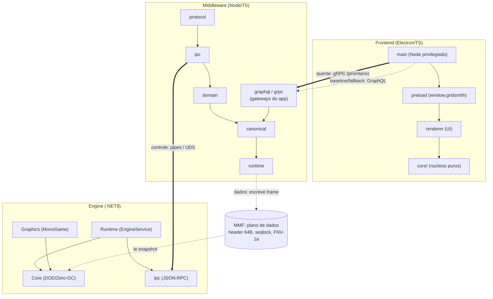
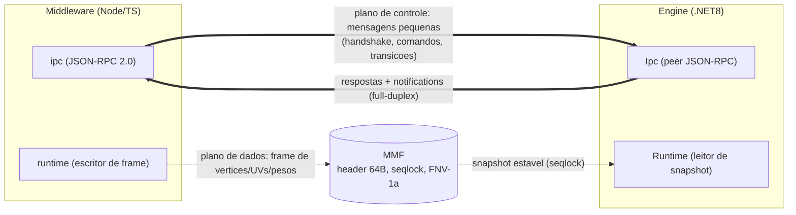
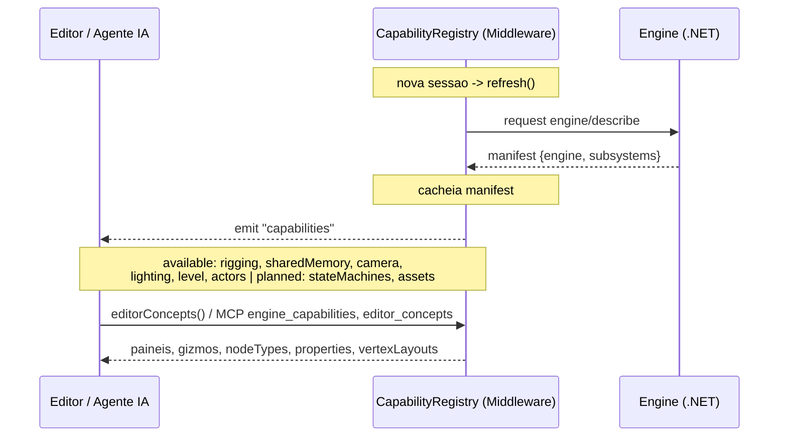
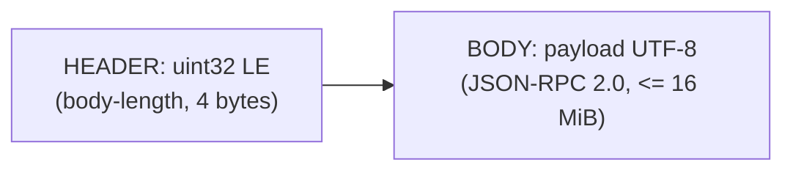
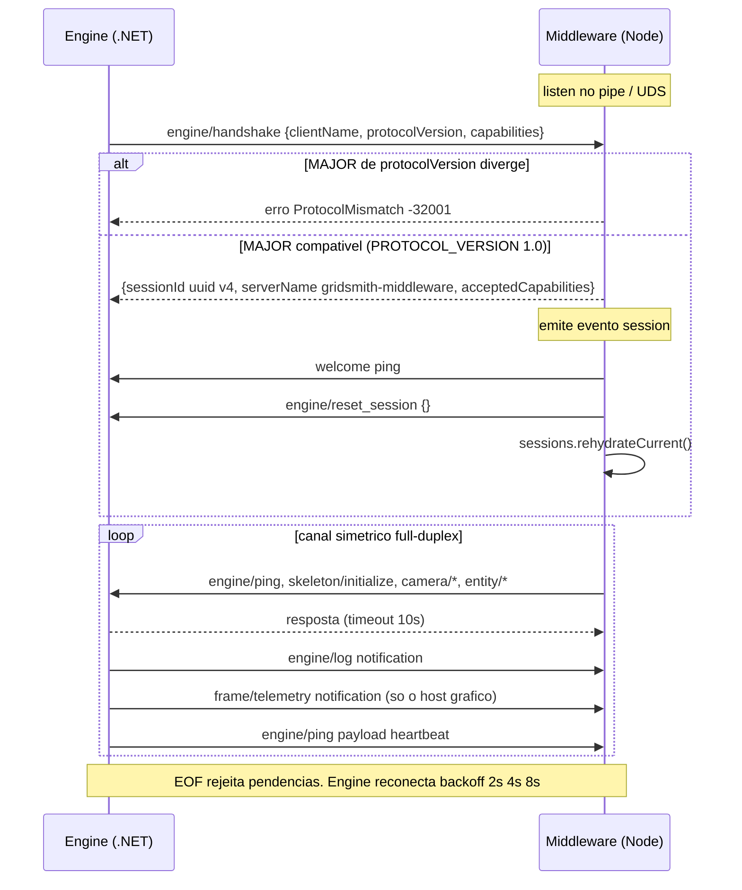
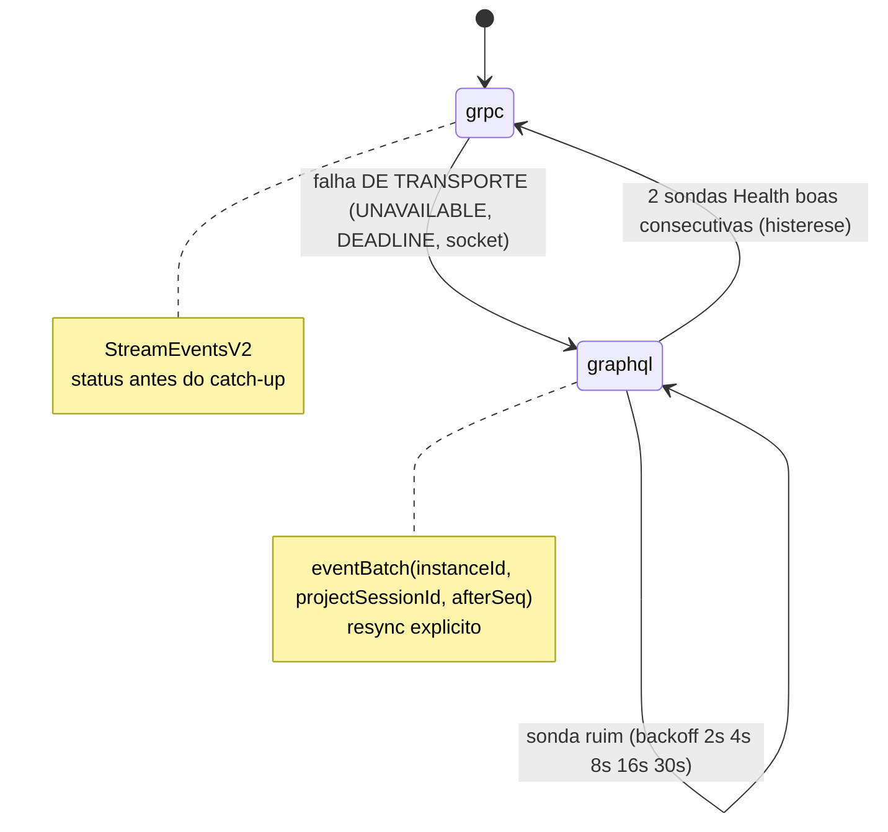

# Arquitetura do Ecossistema Gridsmith EaaS

## Visão geral

*Mostra as tres camadas locais e as tres vias: transports do app (gRPC prioritario com fallback GraphQL, nos gateways do middleware), plano de controle middleware-engine (JSON-RPC sobre pipes/UDS) e plano de dados (MMF com seqlock).*

Duas vias de dados coexistem, cada uma otimizada para seu regime:

1. **Plano de controle (JSON-RPC 2.0):** mensagens pequenas e estruturadas — inicialização
   de esqueletos, binds de shared memory, comandos de câmera, transições de estado.
   Trafega por Named Pipes (Windows) ou Unix Domain Sockets (Linux/macOS).
2. **Plano de dados (Shared Memory):** blocos binários grandes e de alta frequência —
   malhas, pesos de ossos, quadros de animação. Trafega por Memory-Mapped Files com
   layout `LayoutKind.Sequential`, sem serialização JSON. O contrato binário (header,
   seqlock, layouts de vértice, checksum FNV-1a) está em
   [`../contracts/shared-memory-layout.md`](../contracts/shared-memory-layout.md).

*Mostra os dois planos lado a lado: controle (aresta grossa JSON-RPC, mensagens pequenas) e dados (aresta pontilhada, blocos binarios grandes via MMF).*

## Descoberta de capacidades (proxy engine → editor)

A engine é a fonte de verdade do que ela sabe fazer. A cada sessão nova o
`CapabilityRegistry` executa um `refresh` que consulta a engine e cacheia o manifesto:

*Mostra a descoberta de capacidades por sessao: refresh -> engine/describe -> cache do manifest -> emit "capabilities" projetado para UI e ferramentas MCP.*

No método **`engine/describe`** a engine publica um manifesto com:

- **limites reais** de cada subsistema, extraídos das constantes do núcleo DOD
  (ex.: `maxBonesPerSkeleton`);
- **layouts binários de vértice** derivados por reflexão (`Marshal.OffsetOf`) das
  structs `LayoutKind.Sequential` — o escritor Node.js usa esses offsets, nunca
  valores hardcoded, e o teste e2e da Fase 2 confirma a igualdade byte a byte;
- **ganchos de edição visual** (`editor`): painel, gizmos, tipos de nó e propriedades
  editáveis (com tipo, faixa e default) que o editor Electron materializa;
- subsistemas **`planned`** com a fase do roteiro — a UI pode exibi-los como preview.

O middleware cacheia o manifesto no `CapabilityRegistry` a cada sessão e o projeta
como `editorConcepts()` para a UI e como as ferramentas MCP `engine_capabilities` e
`editor_concepts` para agentes de IA. Câmera, iluminação, níveis e atores já são
subsistemas `available` no manifesto — cada um ganhou seu painel/hints sem mudança de
contrato de descoberta.

## Framing do plano de controle

O JSON-RPC 2.0 é trafegado com **prefixo de tamanho** para ser binário-seguro e permitir
parsing incremental sem heurística de delimitadores:

*Mostra o framing do plano de controle: prefixo de 4 bytes com o tamanho do corpo seguido do corpo JSON-RPC UTF-8 (maximo 16 MiB).*

- Tamanho máximo de frame: **16 MiB** (frames maiores encerram a conexão com erro de
  protocolo — dados em massa pertencem ao plano de dados, não ao de controle).
- O mesmo formato é usado nas duas direções; a conexão é **full-duplex e simétrica**:
  ambos os lados podem emitir *requests* (com `id`, aguardam resposta) e *notifications*
  (sem `id`, fire-and-forget).

## Ciclo de vida da conexão

*Mostra o handshake, a criacao de sessao com rehidratacao, o canal full-duplex e a reconexao com backoff exponencial.*

1. O middleware sobe o endpoint (`\\.\pipe\<nome>` no Windows; socket em
   `$XDG_RUNTIME_DIR` ou `/tmp` nos demais) e aguarda conexões.
2. A engine conecta e envia o request **`engine/handshake`** com sua identidade,
   versão de protocolo e capacidades.
3. O middleware valida a versão de protocolo (major deve coincidir) e responde com a
   identidade da sessão e as capacidades habilitadas.
4. O `ProjectSessionManager` executa `engine/reset_session` e reidrata somente a
   sessão de projeto que ainda estiver ativa; sem projeto, o reset deixa a engine
   vazia.
5. A partir daí o canal é simétrico:
   - middleware → engine: `engine/ping`, `skeleton/initialize`, `mesh/bind_shared_memory`, …
   - engine → middleware: `engine/log` (notification), `frame/telemetry`
     (notification, só o host gráfico — o Runtime headless não tem frames;
     ADR-023), heartbeat periódico via `engine/ping` com payload `"heartbeat"`,
     respostas aos requests recebidos.
6. Desconexões são detectadas por EOF/erro de socket; requests pendentes são rejeitados
   imediatamente com erro de transporte. A engine reconecta com backoff exponencial.

## Convenções JSON-RPC

- Métodos usam namespaces com `/`: `engine/*`, `skeleton/*`, `mesh/*`, `camera/*`,
  `lighting/*`, `assets/*`.
- Erros seguem os códigos padrão do JSON-RPC 2.0 (`-32700` parse error, `-32600` invalid
  request, `-32601` method not found, `-32602` invalid params, `-32603` internal error) e
  a faixa `-32000..-32099` para erros de domínio do servidor (ver
  `contracts/schemas/error-codes.md`).
- Os esquemas dos métodos vivem em [`contracts/schemas/`](../contracts/schemas/) e são a
  **fonte única de verdade**; o middleware valida params contra eles na borda.

## Transports do app (GraphQL + gRPC)

O plano de controle JSON-RPC acima é a borda **middleware ↔ engine**. A borda
**app (Electron) ↔ middleware** usa dois transports próprios, decididos em
[ADR-016/017/018/019/020](adr/README.md):

- **GraphQL** ([`../contracts/graphql/editor.schema.graphql`](../contracts/graphql/editor.schema.graphql)):
  superfície **baseline completa** — toda operação do editor existe aqui — e
  também o destino do **fallback**.
- **gRPC** ([`../contracts/grpc/gridsmith_editor.proto`](../contracts/grpc/gridsmith_editor.proto),
  package `gridsmith.editor.v1`): **caminho quente prioritário medido** — `Dispatch`,
  `Query`, `StreamEventsV2` (server streaming com status de cursor) e `Health` —
  mais a paridade de sessão `ProjectCreate/OpenDocument/Close/Status`;
  `StreamEvents` permanece apenas para compatibilidade.

O default gRPC está congelado pelo resultado medido da ADR-019, não por uma
premissa de superioridade: dispatch teve p95 35,2%/39,3% menor e event-flow
30,8%/16,5% menor que GraphQL nos payloads pequeno/médio, sem erro ou resync.
Queries gRPC regrediram nos quatro cenários e permanecem risco explícito.
GraphQL continua baseline completo; o JSON-RPC legado continua apenas por
compatibilidade enquanto houver dependentes.

As quatro bordas do middleware (gateway JSON-RPC do editor, GraphQL, gRPC e
MCP) delegam na mesma superfície `EditorSurface` e na mesma sessão ativa
(`middleware/src/canonical/EditorSurface.ts`): o caminho canônico de mutação
continua **único** — as regras arquiteturais R10–R13 e F5
([`GOVERNANCE.md`](GOVERNANCE.md)) impedem que as bordas ganhem domínio ou que
SDKs de transporte vazem para fora delas.

A política do cliente (`frontend/src/core/transportRouter.ts`) é pura e testada:

*Mostra a política do TransportRouter: gRPC prioritário; falha de transporte cai imediatamente para GraphQL; sondas Health com backoff repromovem só após histerese — falha de DOMÍNIO nunca muda o transporte.*

**Endpoints** (`middleware/src/transport/endpoints.ts` — módulo único consumido
pelos dois lados):

| Plataforma | GraphQL | gRPC |
|---|---|---|
| POSIX | UDS `$XDG_RUNTIME_DIR/<pipe>-graphql.sock` | UDS `$XDG_RUNTIME_DIR/<pipe>-grpc.sock` |
| Windows | TCP `127.0.0.1:<porta derivada>` | TCP `127.0.0.1:<porta derivada>` (grpc-js não suporta named pipes) |

A porta derivada usa FNV-1a em metades disjuntas da faixa dinâmica
49152–65535, sempre em `127.0.0.1`; colisão de bind é explícita. Sockets POSIX
são privados (`0600`) e nunca substituem um listener vivo ou path não-socket.

O Electron gera um token efêmero e o entrega ao middleware por ambiente (ou,
em execução externa, por arquivo privado). GraphQL valida Bearer, gRPC valida
metadata e o gateway legado valida o handshake. Autenticação não é classificada
como indisponibilidade, portanto nunca provoca fallback.

**Continuidade explícita:** o `EventJournal` mantém uma partição por sessão de
projeto e cursor composto `(middlewareInstanceId, projectSessionId, seq)`.
`StreamEventsV2` e
`eventBatch` informam `firstAvailableSeq`, `lastEventSeq` e `resyncRequired`.
Restart, troca de projeto, cursor futuro ou consumidor além da janela retornam zero eventos
parciais; o `EditorClient` busca `snapshot` de todas as projeções, substitui o
estado local e só então reinicia stream/polling. Um `requestId` compartilhado
impede reaplicação de dispatch durante retry cross-transport; a identidade da
sessão de origem faz um retry tardio após A → B falhar explicitamente, sem
contaminar B.

## Sessão de projeto

`ProjectSessionManager` é a única autoridade sobre a referência ativa. Cada
sessão possui `sessionId`, `projectId`, `BlueprintStore`,
`CanonicalOrchestrator`, `CommandHistory` e `createdAt`; `EditorSurface` e as
quatro bordas (JSON-RPC, GraphQL, gRPC e MCP) consultam essa porta em cada
operação.

`project/create`, `project/openDocument`, `project/close` e `project/status`
formam a API de aplicação. Open faz parse → migração → validação → replay em
sessão temporária → validação semântica → reset/reidratação → commit. Create e
open aceitam `expectedProjectSessionId`, validado no commit como
compare-and-swap; um candidato obsoleto nunca sobrescreve uma sessão ativada por
outro cliente. Falha antes do commit preserva sessão, journal, dirty state e
runtime anteriores.

O status de runtime é `synchronized`, `deferred` ou `failed`. `deferred` indica
engine ausente e permite que a sessão canônica siga ativa; `failed` indica que a
compensação/reidratação não restaurou coerência e bloqueia mutações até recovery
integral. Antes de reidratar outro projeto, o adapter executa
`engine/reset_session`, que limpa atores, níveis, luzes, câmera, esqueletos e
readers de shared memory sob um único lock.

**Verbosidade:** `GRIDSMITH_VERBOSITY=silent|error|warn|info|debug|trace` controla os
loggers estruturados dos dois lados (stdout do middleware pertence ao MCP; logs
vão para stderr). E2E das duas fases (gRPC quente + fallback GraphQL):
`scripts/verify-transports.sh`.

## Papel do MCP

O middleware expõe as capacidades do ecossistema a agentes de IA via **Model Context
Protocol** (transporte stdio). As ferramentas MCP são fachadas finas sobre a mesma
`EditorSurface` e a mesma sessão usadas pelas demais bordas — nenhuma lógica de
domínio vive na camada MCP.

## Estado declarativo (AST)

Cada sessão ativa mantém o estado do projeto como uma árvore declarativa
(Blueprint). Toda
mutação entra pelo barramento de comandos (CQRS): comandos imutáveis são validados,
aplicados ao AST e propagados como eventos para os assinantes (UI e engine). A engine é
tratada como uma *projeção materializada* do AST — reconectar significa reidratar.
