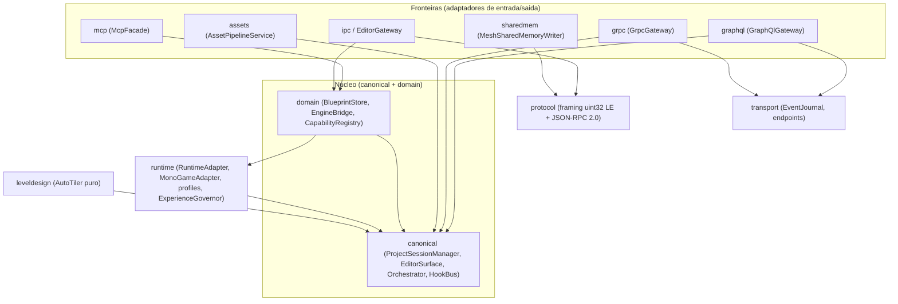
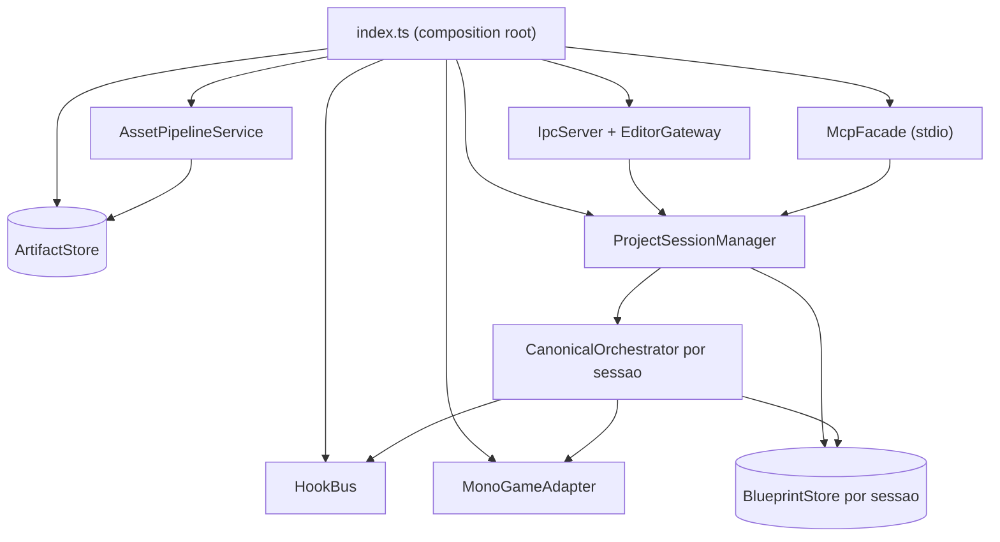

# @gridsmith/middleware

Camada de orquestração do ecossistema Gridsmith EaaS (Node.js ≥ 22, TypeScript).

## Responsabilidades

O grafo de módulos abaixo mostra a **regra de dependência**: as fronteiras
(entrada/saída) dependem para **dentro**, em direção ao núcleo (`canonical` +
`domain`), que não conhece nenhum adaptador. As fitness functions **R1–R13**
(import-graph) impõem exatamente essas setas e proíbem ciclos ou dependências de
saída do núcleo.



*Mostra o grafo de dependência dos módulos: todas as setas apontam para dentro
(fronteiras → núcleo), a invariante que as fitness functions R1–R13 verificam.*

- **Modelo canônico** (`src/canonical/`): `ProjectSessionManager` (sessão
  substituível por commit atômico), `CanonicalOrchestrator` (o único caminho de
  mutação: filters → AST → actions → projeção), `HookBus` (actions/filters com
  prioridade, inspecionável), `ArtifactStore` (artefatos versionáveis com hash estável
  e proveniência) e `PipelineRunner` (estágios como cadeias de filters).

  O caminho de mutação é único: `dispatch(command)` passa pela cadeia de filters
  (que **falham rápido** — um `throw` aborta a cadeia), aplica no store (validação
  + mutação + evento), dispara as actions (**isoladas** — um `throw` é capturado e
  não derruba as demais) e, havendo adapter, projeta o evento.

  ```mermaid
  graph TD
    A["dispatch(command)"] --> B["applyFilters('command:kind')"]
    B -->|"um throw aborta a cadeia"| Bx(["cadeia abortada (fail-fast)"])
    B --> C{"filter preservou o kind?"}
    C -->|"nao"| Cx(["erro: orquestrador exige kind"])
    C -->|"sim"| D["store.apply(filtered)"]
    D --> E["validacao + mutacao + evento"]
    E --> F["doAction('event:kind')"]
    F -->|"actions isoladas: throw capturado"| F
    F --> G{"ha adapter?"}
    G -->|"sim"| H["adapter.project(event)"]
    G -->|"nao"| I["sem projecao"]
    H --> J["doAction('projection:completed')"]
    I --> J
    J --> K(["{ event, projection }"])
  ```

  *Mostra a cadeia única dispatch→filters→store.apply→actions→projection e as
  políticas fail-fast (filters) x isolada (actions) do HookBus.*

- **Runtimes** (`src/runtime/`): `RuntimeAdapter` (contrato de projeção,
  `resetSession` e `rehydrateFrom` obrigatórios),
  `MonoGameAdapter`, `RuntimeProfileRegistry` (perfis versionados por família em
  `profiles/`) e `ExperienceGovernor` (matriz de decisões perfil × manifesto vivo).
  Ver [`../docs/CANONICAL-MODEL.md`](../docs/CANONICAL-MODEL.md).

- **Endpoint IPC do plano de controle** (`src/ipc/`): aceita a conexão da engine via
  Named Pipe (Windows) ou Unix Domain Socket (Linux/macOS), com framing binário
  `uint32 LE + JSON-RPC 2.0` e peer full-duplex simétrico.

  O middleware faz `listen` no pipe/UDS; a engine conecta e envia
  `engine/handshake`. O middleware valida **apenas o MAJOR** de
  `PROTOCOL_VERSION` (`1.0`), responde com um `sessionId` (uuid v4), emite o
  evento `session` e, a cada nova sessão, executa um welcome ping e pede ao
  `ProjectSessionManager` que limpe o runtime e reidrate **somente a sessão de
  projeto ativa**. O canal é full-duplex e simétrico; requests têm
  timeout de 10 s e um EOF rejeita as pendências.

  ```mermaid
  sequenceDiagram
    participant E as Engine (.NET)
    participant M as Middleware (Node)
    Note over M: listen no pipe / UDS
    E->>M: engine/handshake {clientName, protocolVersion, capabilities}
    alt MAJOR de protocolVersion diverge
      M-->>E: erro ProtocolMismatch -32001
    else MAJOR compativel (PROTOCOL_VERSION 1.0)
      M-->>E: {sessionId uuid v4, serverName gridsmith-middleware, acceptedCapabilities}
      Note over M: emite evento session
      M->>E: welcome ping
      M->>E: engine/reset_session {}
      M->>M: sessions.rehydrateCurrent()
    end
    loop canal simetrico full-duplex
      M->>E: engine/ping, skeleton/initialize, camera/*, entity/*
      E-->>M: resposta (timeout 10s)
      E->>M: engine/log notification
      E->>M: frame/telemetry notification (so o host grafico)
      E->>M: engine/ping payload heartbeat
    end
    Note over E,M: EOF rejeita pendencias - engine reconecta backoff 2s 4s 8s
  ```

  *Mostra o handshake, a criação de sessão com rehidratação, o canal full-duplex
  e a reconexão com backoff exponencial.*

- **Gateway do editor** (`src/ipc/EditorGateway.ts`): endpoint `<pipe>-editor` para o
  Electron e clientes de edição — `blueprint/dispatch` (caminho canônico),
  `blueprint/query` (inclui `document`, o snapshot completo do projeto),
  aliases legados `blueprint/load`/`project/new`, operações transacionais
  `project/create`, `project/openDocument`, `project/close`, `project/status`,
  `experience/resolve` e
  broadcast `blueprint/event` para todos os editores (coerência multi-janela).
  Todos os handlers delegam na `EditorSurface` (abaixo).
- **Superfície do editor** (`src/canonical/EditorSurface.ts`): a superfície de
  aplicação **única** que as quatro bordas (gateway JSON-RPC, GraphQL, gRPC e
  MCP) delegam. Ela consulta `ProjectSessionManager` a cada operação, sem reter
  store ou orquestrador fixos. Create/open preparam uma sessão privada e fazem
  commit por CAS (`expectedProjectSessionId`); erro preserva sessão, journal e
  runtime anteriores. `ProjectStatus.runtimeState` distingue `synchronized`,
  `deferred` e `failed`. Erros saem como `JsonRpcError` e cada borda os traduz
  para sua convenção. Regras R10–R13 garantem que nenhuma borda ganhe domínio
  próprio.
- **Transports do app** (`src/graphql/GraphQlGateway.ts`, `src/grpc/GrpcGateway.ts`,
  `src/transport/`): GraphQL é a superfície baseline completa (e o destino do
  fallback); gRPC serve o caminho quente (`Dispatch`, `Query`, `StreamEventsV2`,
  `Health`) e mantém paridade das operações `Project*`. O `EventJournal`
  particiona a janela por `projectSessionId`; o cursor
  `(middlewareInstanceId, projectSessionId, seq)` dá continuidade entre stream
  gRPC e polling GraphQL, e restart/gap/troca exigem ressincronização explícita.
  `endpoints.ts` resolve UDS/porta
  derivada nas duas pontas. Contratos em `contracts/graphql/` e
  `contracts/grpc/` (ADR-016/017/018/019/020 em `../docs/adr/`).
- **Estado declarativo / AST** (`src/domain/BlueprintStore.ts`): CQRS — cada
  `ProjectSession` possui store, orquestrador e histórico próprios; comandos
  imutáveis são validados e aplicados ao Blueprint ativo, e leituras são
  projeções congeladas.
- **Ponte da engine** (`src/domain/EngineBridge.ts`): diagnósticos da sessão viva
  (ping/inspeções); mutações, reset e reidratação passam pelo adapter e pelo
  `ProjectSessionManager`.
- **Registro de capacidades** (`src/domain/CapabilityRegistry.ts`): pede
  `engine/describe` a cada sessão e projeta o manifesto como conceitos de edição
  visual (`editorConcepts()`) — o proxy entre as possibilidades da engine e a UI.
- **Plano de dados** (`src/sharedmem/`): `MeshSharedMemoryWriter` publica vértices no
  memory-mapped file com protocolo seqlock, guiado pelo layout binário publicado pela
  engine (nunca offsets hardcoded).
- **Level design** (`src/leveldesign/AutoTiler.ts`): auto-tiling determinístico por
  regras de padrão (LDtk/Tiled) — função pura `(IntGrid, regras, seed) → tiles`,
  consumida pela engine via `tilemap/define`.
- **Assets** (`src/assets/`): `AsepriteImporter` normaliza o export CLI (frameTags →
  clipes, slices → pivô/9-slice); `AssetPipelineService` orquestra o catálogo
  taxonômico — watcher recursivo, export via CLI Aseprite, artefato canônico com tags
  por diretório e compile MGCB para `.xnb` (`ToolRunner` injetável; erros tipados;
  ativado com `--assets <dir>`).
- **Fachada MCP** (`src/mcp/McpFacade.ts`): expõe a agentes de IA, via stdio,
  o comando genérico `blueprint_command` (TODOS os kinds canônicos de
  `COMMAND_KINDS` — inclusive `level/update` e `entity/move`) + ferramentas
  curadas por domínio (`camera_*`, `light_*`, `level_define/update/remove`,
  `entitydef_define`, `entity_place/move/remove`, `world_*`), diagnóstico
  operações da mesma sessão (`project_create`, `project_open_document`,
  `project_close`, `project_status`), diagnóstico
  (`engine_status`, `engine_ping`, `mesh_inspect`, `engine_capabilities`,
  `editor_concepts`, `runtime_*`, `hooks_list`, `artifact_get`) e assets
  (`asset_*`, com `--assets <dir>`).

### Composition root (`index.ts`)

`index.ts` é a única raiz de composição: instancia cada colaborador e faz o
_wiring_ das dependências (que sempre apontam para dentro, conforme o grafo
acima). Nenhum módulo constrói suas próprias dependências — todas chegam prontas
por injeção a partir daqui.



*Mostra a raiz de composição `index.ts` montando um único manager; cada sessão
preparada recebe store, histórico e orquestrador próprios, e todas as bordas
consultam a mesma referência ativa.*

## Comandos

```bash
npm install
npm run build     # tsc → dist/
npm test          # node:test — framing, peer, integração via socket real
npm start         # pipe server + MCP em stdio
npm run dev -- --pipe gridsmith-engine --no-mcp   # apenas o plano de controle
npm run dev -- --pipe gridsmith-engine --no-grpc  # desliga o gateway gRPC (fica só GraphQL)
```

Flags dos transports do app: `--no-grpc` e `--no-graphql` desligam os gateways
individualmente (ambos sobem por padrão).

## Convenções

- stdout pertence ao transporte MCP; logs operacionais vão para **stderr**,
  com verbosidade controlada por `GRIDSMITH_VERBOSITY`
  (`silent|error|warn|info|debug|trace`, default `info`) — logger puro em
  `src/util/log.ts` com sink injetável para testes.
- Nenhuma lógica de domínio na camada MCP — apenas fachadas sobre o barramento
  de comandos.
- Contratos de fio em [`../contracts/schemas/`](../contracts/schemas/).
